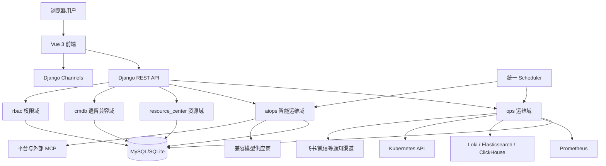
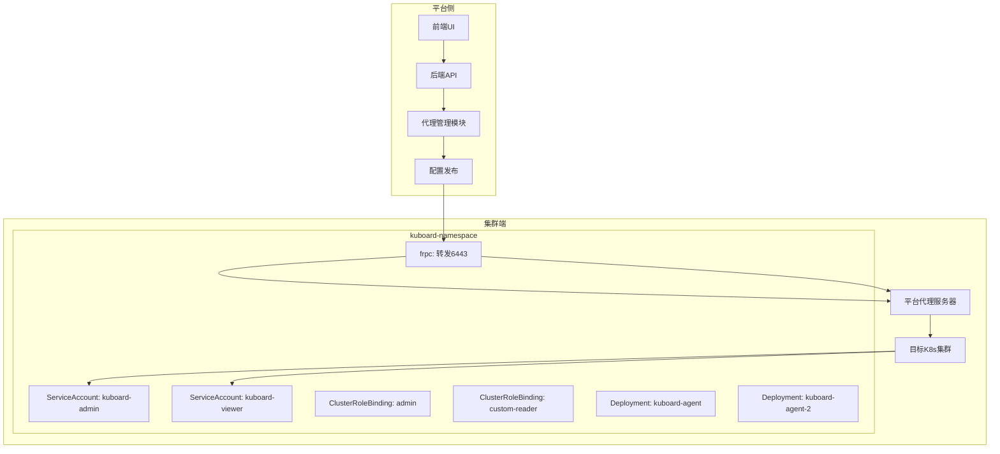

# K8s 集群代理接入设计方案

## 1. 执行摘要

本方案旨在为 Xing-Cloud 平台提供一个基于 Kuboard Agent 的 K8s 集群反向接入方案，实现管理员权限和只读权限的分离。通过在目标集群内部部署代理，实现无需公网即可管理 K8s 资源，同时确保安全访问控制和权限隔离。

## 2. 背景与现状

### 2.1 当前挑战
- Xing-Cloud 平台现有 K8s 集群接入主要依赖静态 kubeconfig 文件
- 需要手动管理 Token/CA，部署复杂且安全性较低
- 无法满足异构网络环境（VPC、专用网）的集群接入需求
- 证书验证问题（如高可用集群的 VIP 证书校验失败）

### 2.2 需求分析
- 支持纯内网访问的集群接入方案
- 细粒度权限控制（管理员与只读用户分离）
- 低运维复杂度（自动化部署与管理）
- 安全可靠（ServiceAccount 认证，反向代理）

## 3. 解决方案架构

### 3.1 总体架构图



### 3.2 代理架构图



## 4. 详细设计

### 4.1 权限模型

#### 4.1.1 ServiceAccount 设计

```yaml
# 管理员权限 ServiceAccount
apiVersion: v1
kind: ServiceAccount
metadata:
  name: kuboard-admin
  namespace: kuboard

# 只读权限 ServiceAccount
apiVersion: v1
kind: ServiceAccount
metadata:
  name: kuboard-viewer
  namespace: kuboard
```

#### 4.1.2 ClusterRole 权限定义

**管理员权限 (ClusterRole: cluster-admin)**
- 提供集群级别的完全控制权限
- 用于管理员执行重启 Pod、伸缩工作负载、编辑配置等操作

**只读权限 (ClusterRole: kuboard-viewer-custom)**
```yaml
apiVersion: rbac.authorization.k8s.io/v1
kind: ClusterRole
metadata:
  name: kuboard-viewer-custom
rules:
# 核心资源只读访问
- apiGroups: [""]
  resources: ["nodes","services","pods"]
  verbs: ["get","list","watch"]
# 工作负载只读访问
- apiGroups: ["apps"]
  resources: ["deployments","statefulsets","daemonsets","jobs","cronjobs"]
  verbs: ["get","list","watch"]
# 存储类只读访问
- apiGroups: ["storage.k8s.io"]
  resources: ["storageclasses"]
  verbs: ["get","list","watch"]
```

#### 4.1.3 ClusterRoleBinding

```yaml
# 管理员 ClusterRoleBinding
apiVersion: rbac.authorization.k8s.io/v1
kind: ClusterRoleBinding
metadata:
  name: kuboard-admin-crb
subjects:
- kind: ServiceAccount
  name: kuboard-admin
  namespace: kuboard
roleRef:
  kind: ClusterRole
  name: cluster-admin
  apiGroup: rbac.authorization.k8s.io

# 只读 ClusterRoleBinding
apiVersion: rbac.authorization.k8s.io/v1
kind: ClusterRoleBinding
metadata:
  name: kuboard-viewer-crb
subjects:
- kind: ServiceAccount
  name: kuboard-viewer
  namespace: kuboard
roleRef:
  kind: ClusterRole
  name: kuboard-viewer-custom
  apiGroup: rbac.authorization.k8s.io
```

### 4.2 代理部署

#### 4.2.1 Docker 镜像配置

```dockerfile
FROM swr.cn-east-2.myhuaicloud.com/kuboard/kuboard-agent:v3

# 安装额外依赖
RUN apt-get update && \
    apt-get install -y \
    ca-certificates && \
    rm -rf /var/lib/apt/lists/*

# 创建应用用户
RUN useradd -m -u 1000 agent

WORKDIR /app
```

#### 4.2.2 Deployment 配置

```yaml
apiVersion: apps/v1
kind: Deployment
metadata:
  name: kuboard-agent
  namespace: kuboard
  labels:
    app: kuboard-agent
spec:
  replicas: 1
  selector:
    matchLabels:
      app: kuboard-admin
  template:
    metadata:
      labels:
        app: kuboard-admin
    spec:
      serviceAccountName: kuboard-admin
      tolerations:
      - effect: NoSchedule
        key: node-role.kubernetes.io/master
        operator: Exists
      containers:
      - name: agent
        image: swr.cn-east-2.myhuaicloud.com/kuboard/kuboard-agent:v3
        imagePullPolicy: Always
        env:
        - name: KUBOARD_ENDPOINT
          value: "http://your-platform-domain.com"
        - name: KUBOARD_AGENT_SERVER_TCP_PORT
          value: "30567"
        - name: KUBOARD_K8S_CLUSTER_NAME
          value: "my-cluster"
        - name: KUBERNETES_TOKEN_NAME
          value: "kuboard-admin"
        - name: KUBOARD_ANONYMOUS_TOKEN
          value: "your-secure-token"
        livenessProbe:
          exec:
            command: ["/health.sh"]
          failureThreshold: 3
          periodSeconds: 60
        resources:
          requests:
            cpu: 100m
            memory: 128Mi
          limits:
            cpu: 500m
            memory: 512Mi
```

### 4.3 配置管理

#### 4.3.1 frp 配置文件

```ini
# /etc/kuboard/agent.ini
[common]
server_addr = your-platform-domain.com
server_port = 30567
token = your-secure-token
log_path = /var/log/frp.log
log_level = info

[proxy my-k8s-proxy]
type = tcp
local_ip = 127.0.0.1
local_port = 6443
remote_port = 6443
```

#### 4.3.2 平台连接配置

```yaml
# 平台侧 kubeconfig
apiVersion: v1
kind: Config
clusters:
- name: xingcloud-proxy
  cluster:
    server: https://your-platform-domain.com:30567
    insecure-skip-tls-verify: true
users:
- name: xingcloud-proxy
  user:
    token: {{DYNAMICALLY_GENERATED_TOKEN}}
contexts:
- name: xingcloud-proxy
  context:
    cluster: xingcloud-proxy
    user: xingcloud-proxy
current-context: xingcloud-proxy
```

### 4.4 前端集成

#### 4.4.1 前端路由配置

```javascript
// Vue Router 配置
{
  path: '/k8s/clusters/:id/proxy',
  name: 'K8sProxy',
  component: K8sProxyComponent,
  props: route => ({
    clusterId: route.params.id,
    useAdminProxy: route.query.admin === '1'
  })
}
```

#### 4.4.2 API 服务端点

```javascript
// API 端点定义
{
  path: '/api/k8s/clusters/:id/agent/status',
  method: 'get',
  handler: getAgentStatus
}

{
  path: '/api/k8s/clusters/:id/agent/deploy',
  method: 'post',
  handler: deployAgent
}

{
  path: '/api/k8s/clusters/:id/agent/rotate-token',
  method: 'post',
  handler: rotateAgentToken
}
```

## 5. 实施计划

### 5.1 阶段划分

| 阶段 | 持续时间 | 主要任务 | 交付成果 |
|-------|-------------|-----------|-------------|
| **规划阶段** | 1 周 | 需求分析，架构设计，风险评估 | 设计文档，风险报告 |
| **开发阶段** | 3 周 | 核心模块开发，代理编写，前端集成 | 可运行系统 |
| **测试阶段** | 2 周 | 单元测试，集成测试，用户验收测试 | 测试报告，稳定系统 |
| **部署阶段** | 1 周 | 生产环境部署，数据迁移，权限配置 | 正式上线 |
| **运维阶段** | 持续 | 监控，日志，巡检 | 运维手册，监控系统 |

### 5.2 关键里程碑

1. **周 1-2：** 完成设计文档编写，获得 stakeholders 批准
2. **周 3-5：** 完成核心模块开发，完成前端与后端的集成
3. **周 6-7：** 完成代理开发与测试，完成系统集成测试
4. **周 8：** 完成生产环境部署，验证所有功能正常运行
5. **周 9-12：** 持续监控与优化，完成文档与培训

## 6. 风险评估

### 6.1 风险矩阵

| 风险 | 影响 | 概率 | 等级 | 缓解措施 |
|------|--------|------------|---------|------------|
| **代理部署失败** | 中 | 中 | 中 | 多节点部署，自动重试 |
| **权限配置错误** | 高 | 低 | 高 | 自动化测试，代码审查 |
| **Token 泄露** | 高 | 中 | 高 | Secret 加密，定期轮换 |
| **网络连接问题** | 中 | 中 | 中 | 健康检查，自动重连 |
| **应用兼容性问题** | 中 | 低 | 中 | 版本控制，回退测试 |

### 6.2 风险缓解

1. **权限配置**：通过自动化脚本验证 ClusterRoleBinding 的正确性
2. **Token 管理**：使用 Kubernetes Secret 存储，设置自动轮换策略
3. **部署验证**：通过健康检查和状态监控确保代理正常运行
4. **错误恢复**：设计自动重试机制，减少人工干预

## 7. 测试策略

### 7.1 单元测试

| 测试模块 | 覆盖率目标 | 测试工具 |
|--------------|---------------|-----------|
| 权限配置 | 100% | Jest/Mock |
| 代理启动 | 95% | 集成测试 |
| frp 配置 | 90% | 自动化脚本 |
| 前端集成 | 85% | Cypress |

### 7.2 集成测试

1. **代理部署测试**：验证 ServiceAccount、ClusterRoleBinding、Deployment 的创建
2. **权限验证测试**：验证管理员和只读代理的权限范围
3. **反向连接测试**：验证平台侧代理与集群的连接状态
4. **认证授权测试**：验证 Token 的正确性，权限控制

### 7.3 用户验收测试

1. **管理员权限测试**：验证管理员代理的完整权限
2. **只读权限测试**：验证只读代理的只读权限
3. **故障恢复测试**：验证代理故障时的自动重连
4. **性能测试**：验证代理的响应时间和连接稳定性

## 8. 运维与维护

### 8.1 监控

| 监控项 | 指标 | 报警阈值 |
|------------|--------|---------------|
| 代理 CPU 使用率 | >80% | 持续 5 分钟 |
| 代理内存使用率 | >90% | 持续 3 分钟 |
| frp 连接状态 | 离线 | 持续 1 分钟 |
| Token 有效期 | <24 小时 | 提前 4 小时 |
| 权限变更 | 成功/失败 | 实时记录 |

### 8.2 日志

```yaml
# /etc/kuboard/agent-logrotate.conf
/var/log/frp.log {
    daily
    rotate 7
    compress
    delaycompress
    missingok
    notifempty
    create 644 root root
}
```

### 8.3 升级

```bash
# 升级流程
#!/bin/sh

set -e

# 1. 备份当前配置
kubectl get configmap/frp-config -n kuboard -o yaml > /tmp/frp-config-backup-$(date +%Y%m%d)

# 2. 更新镜像
kubectl set image deployment/kuboard-agent kuboard-agent=new-image:v2 -n kuboard

# 3. 验证状态
kubectl rollout status deployment/kuboard-agent -n kuboard --timeout=300s
```

## 9. 实施检查清单

### 9.1 开发环境准备

```bash
# Kubernetes 集群要求
kubectl version --client
kubectl cluster-info

# Docker 环境要求
docker version

# 网络要求
curl -I http://your-platform-domain.com
telnet your-platform-domain.com 30567
```

### 9.2 部署脚本

```bash
#!/bin/sh
# deploy-agent.sh
set -e

# 1. 安装 Kubernetes 客户端
# 2. 创建命名空间
# 3. 应用 ServiceAccount 和 ClusterRoleBinding
# 4. 部署管理员和只读代理
# 5. 验证部署状态
# 6. 生成 kubeconfig
```

### 9.3 配置验证

```bash
#!/bin/sh
# validate-config.sh

set -e

# 1. 验证 frp 配置
# 2. 验证 Kubernetes 权限
# 3. 验证代理连接状态
# 4. 输出部署摘要
```

## 10. 附录

### 10.1 参考文献

1. Kuboard v3 官方文档
2. Kubernetes RBAC 设计文档
3. frp 内网穿透工具文档
4. Xing-Cloud 现有 K8s 集群接入方案

### 10.2 术语表

| 术语 | 定义 |
|------|------------|
| ServiceAccount | Kubernetes 用于身份验证的账户 |
| ClusterRole | 集群级别的权限定义 |
| ClusterRoleBinding | 绑定 ClusterRole 到 Subject 的机制 |
| frp | 一个用于内网穿透的工具 |
| kubeconfig | Kubernetes 客户端配置文件的名字 |

---

## 11. 结束语

本设计方案旨在为 Xing-Cloud 平台提供一个安全、高效、易于管理的 K8s 集群反向接入方案。通过采用双身份代理设计，可以确保集群管理的精细化控制，同时降低运维复杂度。实施过程中需要密切关注安全性和可用性，确保系统稳定运行。

**注意**：本设计方案尚未经过完整的验证，需要在实际环境中进行测试和验证。实施时应根据具体情况进行调整，并确保满足安全和合规要求。

---
*文档版本：1.0*
*日期：2025年8月*
*作者：Xing-Cloud 平台团队*