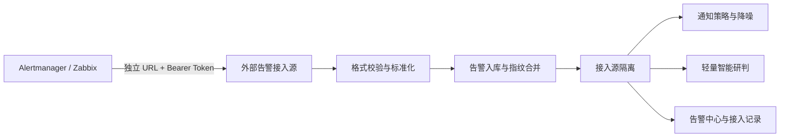

# 外部告警接入与管控指南

> 实施状态：当前代码已实现。上线时需要执行数据库迁移并运行告警分析 Worker。新接入源不依赖生产 Secret 中的 `WEBHOOK_TOKEN`。

## 1. 功能定位

平台以“接入源”为管理边界接收 Alertmanager 和 Zabbix 告警。每个接入源拥有独立地址、独立 Bearer Token 和运行开关，外部告警规则仍由原系统维护，平台不复制其规则，也不要求绑定知识图谱或业务上下文。



核心行为：

- 外部标签原样保存，不强制增加 `environment` 或 `cluster`。
- 同一个外部指纹在不同接入源中相互隔离。
- 外部告警与平台业务上下文相互独立，使用接入源、外部指纹和原始标签进行管理。
- 首次触发、重复命中、恢复、升级、静默、抑制和聚合复用平台现有告警链路。
- 轻量研判只依据外部告警文本和原始载荷，置信度上限为 50%。

## 2. 页面操作

入口：`可观测性 -> 告警配置 -> 外部告警接入`。

### 2.1 新增接入源

点击“新增接入源”，配置：

| 字段 | 说明 |
|---|---|
| 名称 | 页面显示名称，例如“生产 Alertmanager” |
| 编码 | 稳定标识，创建后不可修改 |
| 类型 | `Alertmanager` 或 `Zabbix`，创建后不可修改 |
| 每分钟请求上限 | 单个接入源的请求限流，范围 1 到 10000 |
| 允许接入 | 关闭后拒绝该地址的所有请求 |
| 发送通知 | 控制首次、恢复、升级和研判结果是否允许外发 |
| 智能研判 | 控制新活动周期是否创建轻量研判任务 |

新接入源默认允许入库、开启研判、关闭通知。应先完成载荷测试，再开启通知，避免与原告警链路重复发送。

保存后平台只显示一次：

- 独立接入地址：`/api/ops/alert-ingress/{source_key}/`
- Bearer Token

平台仅保存 Token 的 SHA-256 摘要，无法再次读取明文。丢失后使用“轮换 Token”，旧 Token 会立即失效。

### 2.2 载荷测试与接入状态

配置页的“测试”功能可以粘贴一份 Alertmanager 或 Zabbix JSON，预览格式识别、级别、状态、命名空间和资源，不会创建真实告警。

接入源列表展示健康状态、通知/研判开关、活跃告警、累计接收数和最近接收时间。

点击“记录”查看最近请求：

- 接收、拒绝或处理失败状态。
- HTTP 状态码、来源地址、耗时和告警数量。
- 失败原因和安全的载荷摘要，不保存 Token。

无效 Token、停用源和限流请求的拒绝日志按接入源与来源地址限速，避免扫描流量持续写数据库。

### 2.3 查看已接入告警

入口：`可观测性 -> 告警中心`。

页面支持：

- 来源筛选：Alertmanager、Zabbix、平台规则等。
- 告警范围：当前业务上下文、全部外部告警、全部告警。
- 告警详情：接入源、原始标签、通知记录、时间线和研判结果。

“全部外部告警”不受当前业务上下文切换影响，可集中查看所有 Alertmanager 和 Zabbix 接入源产生的告警。

## 3. 平台通知配置

外部告警没有平台 `AlertRule`。是否发送由两层共同决定：

1. 接入源的“发送通知”开关。
2. 平台通知策略、静默、抑制、聚合和重复间隔。

配置路径：`可观测性 -> 告警配置 -> 通知策略 -> 新增通知策略`。

最小配置步骤：

1. “作用来源”选择“外部告警接入源”。
2. 选择具体的 Alertmanager 或 Zabbix 接入源。
3. 选择通知渠道；需要按人员分发时再选择接收组。
4. 按需设置最低级别和标签匹配条件。
5. 保存并使用“预览路由结果”确认命中的策略和渠道。
6. 回到外部告警接入页，开启该接入源的“发送通知”。

选择接入源后，策略只处理该源进入的告警。平台规则告警和其他外部接入源不会命中这条策略；“全部告警（全局）”策略仍可作为兜底。外部接入源策略默认将 `ingress_source_code` 纳入聚合键，避免不同来源的同名告警混组。

在来源作用域之外，还可以使用以下标签匹配条件进一步筛选：

| 条件 | 示例 |
|---|---|
| 外部标签 | `label.namespace == kube-ai` |
| 标准维度 | `cluster == production`、`namespace == kube-ai` |
| 自定义标签 | `label.team == platform` |

“智能研判”与“发送通知”相互独立：可以只在平台内生成研判而不外发。接入源关闭通知时，研判仍可入库，但研判结果不会单独发送。

## 4. Alertmanager 并行接入

以下配置不替换原接收器。平台路由使用 `continue: true`，命中后继续进入原有告警链路。

### 4.1 创建平台接入源

在页面创建 Alertmanager 接入源，保存页面显示的独立 URL 和 Token。下文使用：

```text
<XING_CLOUD_ENDPOINT>
<XING_CLOUD_TOKEN>
```

### 4.2 保存 Token 到 monitoring Secret

不要把 Token 写入 Git。可在受控终端中执行：

```bash
read -r -s -p "Xing-Cloud Token: " XING_CLOUD_TOKEN; echo
kubectl -n monitoring create secret generic xing-cloud-webhook-token \
  --from-literal=token="$XING_CLOUD_TOKEN" \
  --dry-run=client -o yaml | kubectl apply -f -
unset XING_CLOUD_TOKEN
```

Prometheus Operator 管理的 Alertmanager 需要挂载这个 Secret。在 Alertmanager 自定义资源的 `spec` 中保留已有条目并追加：

```yaml
spec:
  secrets:
    - xing-cloud-webhook-token
```

挂载路径通常为：

```text
/etc/alertmanager/secrets/xing-cloud-webhook-token/token
```

### 4.3 增加接收器

```yaml
receivers:
  # 保留现有 receivers
  - name: xing-cloud-webhook
    webhook_configs:
      - url: <XING_CLOUD_ENDPOINT>
        send_resolved: true
        http_config:
          authorization:
            type: Bearer
            credentials_file: /etc/alertmanager/secrets/xing-cloud-webhook-token/token
```

`send_resolved: true` 必须保留，否则平台无法把同一告警转为已恢复。

### 4.4 增加并行路由

把平台路由放在原业务路由之前：

```yaml
route:
  group_by: [namespace, alertname]
  group_wait: 10s
  group_interval: 1m
  repeat_interval: 12h
  receiver: Default
  routes:
    - matchers:
        - alertname = Watchdog
      receiver: Watchdog

    - matchers:
        - alertname = InfoInhibitor
      receiver: "null"

    - matchers:
        - severity =~ warning|info|critical
      receiver: xing-cloud-webhook
      continue: true

    - matchers:
        - severity =~ warning|info|critical
      receiver: ops-agent-webhook
```

### 4.5 原地更新配置

不要先删除 `alertmanager-main` Secret。使用原地更新避免配置空窗：

```bash
kubectl -n monitoring create secret generic alertmanager-main \
  --from-file=alertmanager.yaml=/tmp/alertmanager-config.yaml \
  --dry-run=client -o yaml | kubectl apply -f -
```

先观察 config-reloader 和 Alertmanager 日志。只有未自动重载时再滚动重启：

```bash
kubectl -n monitoring logs alertmanager-main-0 -c config-reloader --tail=50
kubectl -n monitoring logs alertmanager-main-0 -c alertmanager --tail=100
kubectl -n monitoring rollout restart statefulset alertmanager-main
kubectl -n monitoring rollout status statefulset alertmanager-main --timeout=300s
```

## 5. Zabbix 接入

### 5.1 创建 Webhook 媒介类型

在 Zabbix 的 Webhook 媒介类型中配置页面生成的 URL 和 Token。请求头使用标准 Bearer：

```text
Authorization: Bearer <XING_CLOUD_TOKEN>
Content-Type: application/json
```

如果当前 Zabbix Webhook 编辑器需要 JavaScript，可用等价逻辑：

```javascript
var params = JSON.parse(value);
var request = new HttpRequest();
request.addHeader('Content-Type: application/json');
request.addHeader('Authorization: Bearer ' + params.token);
return request.post(params.url, JSON.stringify(params.payload));
```

### 5.2 推荐载荷

```json
{
  "event_id": "{EVENT.ID}",
  "trigger_id": "{TRIGGER.ID}",
  "trigger_name": "{TRIGGER.NAME}",
  "severity": "{EVENT.SEVERITY}",
  "host_name": "{HOST.NAME}",
  "subject": "{ALERT.SUBJECT}",
  "message": "{ALERT.MESSAGE}",
  "timestamp": "{EVENT.DATE} {EVENT.TIME}",
  "event_status": "{EVENT.STATUS}",
  "environment": "",
  "service": ""
}
```

`PROBLEM` 映射为活动告警，`RESOLVED`、`OK`、`RECOVERY` 映射为恢复。触发与恢复必须使用相同的 `trigger_id + host_name`，平台才能更新同一告警。

## 6. API 行为

### 6.1 独立接入端点

```http
POST /api/ops/alert-ingress/{source_key}/
Authorization: Bearer <token>
Content-Type: application/json
```

同时兼容 `X-Webhook-Token`，但新配置统一推荐 Bearer。请求体上限默认 1 MiB。

响应状态：

| HTTP | 含义 |
|---|---|
| 201 | 至少创建了一条新告警 |
| 200 | 全部为重复命中、状态更新或恢复 |
| 400 | 载荷为空、来源无法识别或接入源类型不匹配 |
| 401 | Token 缺失或错误 |
| 403 | 接入源已停用 |
| 413 | 请求体超过限制 |
| 429 | 超过接入源每分钟请求上限 |

Alertmanager 一次推送多条 `alerts` 时会逐条处理，并返回 `results` 数组。

### 6.2 兼容入口

旧地址继续保留：

```text
/api/ops/alerts/ingest/
/api/alerts/ingest/
```

旧入口使用生产配置中的全局 `WEBHOOK_TOKEN` / `WEBHOOK_TOKENS`，没有接入源页面统计或独立 Token。已有调用方可以继续使用，新接入统一使用独立端点。

## 7. 部署与验收

部署步骤：

```bash
cd backend
python manage.py migrate
python manage.py check
```

并确保告警分析 Worker 或包含该消费逻辑的 Scheduler 正常运行。

验收顺序：

1. 在页面创建接入源，暂时保持“发送通知”关闭。
2. 使用“测试”预览并验证样例载荷格式。
3. 配置外部系统后触发一条测试告警。
4. 确认接入记录为“已接收”，告警中心出现 Alertmanager/Zabbix 告警。
5. 发送同指纹告警，确认告警 ID 不变、出现次数增加。
6. 发送恢复事件，确认同一告警变为已恢复。
7. 新增通知策略，将“作用来源”选为该外部接入源并配置渠道，通过路由预览确认命中后，再开启接入源“发送通知”。
8. Alertmanager 并行接入时确认原接收器仍正常，且没有向同一接收人产生双份通知。

## 8. 数据与安全边界

- Token 明文仅在创建和轮换响应中出现一次，数据库只保存摘要和尾号。
- 管理 API 使用 `ops.alert.config.view/manage` 后端权限；前端隐藏不作为安全控制。
- 接入日志只保存载荷顶层键、状态和 receiver 等摘要，不保存完整原始请求。
- 完整外部载荷随告警证据保存，访问受告警查看权限控制。
- 已产生告警或接入记录的接入源不能删除，只能停用，以保留审计关系。
- 接入源关闭通知时，首次、恢复、升级和研判通知均不外发；研判可继续在平台内入库。
- 外部告警不参与知识图谱绑定健康检查；历史外部告警在升级迁移后会解除已有业务上下文关联。
