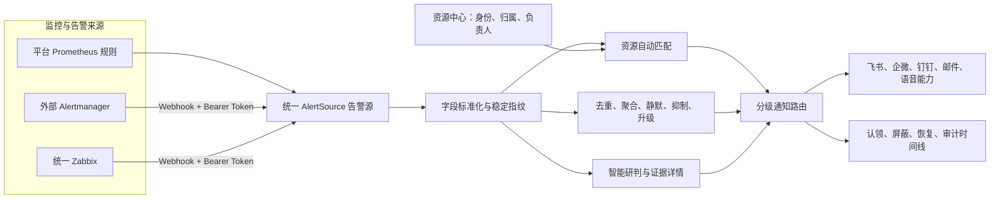
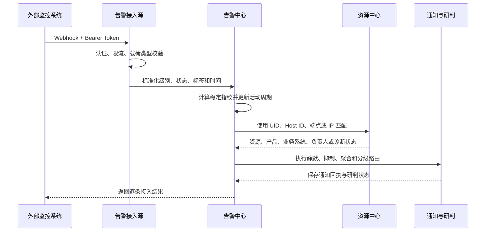

# 外部告警接入、资源关联与通知路由方案

> 文档定位：面向管理汇报、产品设计和实施交付。
>
> 当前范围：Prometheus、Alertmanager、Zabbix 告警源统一管理；外部告警通过 Webhook 接入平台。
>
> 关联文档：[资源中心设计与迁移](资源中心设计与迁移.md)、[资源中心使用手册](资源中心使用手册.md)、[告警源规则与通知配置使用手册](告警源规则与通知配置使用手册.md)。

## 1. 汇报摘要

平台将原来分散在 Prometheus、Alertmanager、Zabbix 中的告警统一接入一个告警中心，并通过资源中心自动识别告警对应的产品、业务系统和负责人，形成“统一接入、统一降噪、自动分派、分级通知、智能研判、处置留痕”的闭环。

本方案不要求迁移外部系统已有规则。各监控系统继续负责采集和规则触发，平台负责告警进入后的标准化处理与协同处置。

| 建设重点 | 解决的问题 | 业务价值 |
| --- | --- | --- |
| 统一告警源 | 不同监控系统入口、认证和状态分散 | 一个页面管理来源、负责人、开关和接入质量 |
| 稳定指纹与降噪 | 重复告警、状态抖动、告警风暴 | 合并同一故障活动周期，降低重复打扰 |
| 资源自动匹配 | 告警只有 IP、Host ID、Pod 等技术标签 | 自动补全产品、业务系统、资源和责任人 |
| 分级通知 | 所有级别发送到同一群，严重告警触达不足 | Warning、Critical 可走不同群和升级渠道 |
| 证据化研判 | 人工跨系统查指标、事件和日志 | 统一生成研判结果和详情页，缩短定位时间 |
| 全程审计 | 告警是否发送、由谁处理难以追踪 | 保留接入、通知、认领、屏蔽、恢复和研判记录 |

## 2. 建设背景

企业通常已有统一 Zabbix、多个 Alertmanager 和平台自建 Prometheus。现状主要有四类问题：

1. **来源分散**：每套系统独立配置 Webhook、群机器人和接收人，变更成本高。
2. **归属缺失**：告警中常只有 IP、实例或 Pod，无法直接判断属于哪个产品、由谁负责。
3. **通知粗放**：警告和严重告警进入同一渠道，升级依赖人工转发。
4. **处置割裂**：通知、研判、认领、屏蔽、恢复和复盘缺少统一时间线。

特别是“一个 Zabbix 监控多个产品”的场景，不能简单把一个告警源绑定到一个产品。平台需要使用每条告警携带的 `host_id`、`host_ip`、`instance`、K8S UID 等标识逐条匹配资源，再决定通知对象。

## 3. 总体设计



### 3.1 核心原则

- **告警源与业务归属解耦**：告警源说明“从哪里来”，资源中心说明“属于谁”。
- **外部接入不依赖业务上下文**：未绑定 AIOps 业务上下文也可接收、去重、展示和通知。
- **告警规则保留在原系统**：Alertmanager、Zabbix 继续维护原有规则，平台不复制规则。
- **唯一匹配才自动分派**：多候选时明确标记冲突，不猜测负责人。
- **研判跟随告警策略**：被静默、抑制或聚合的告警，其研判结果不能绕过策略单独发送。
- **恢复沿用活动周期**：恢复通知沿用本次告警已确定的来源、资源和接收范围。

## 4. 告警源统一管理

平台使用统一 `AlertSource` 管理三类来源：

| 类型 | 触发方式 | 平台职责 | 是否绑定业务上下文 |
| --- | --- | --- | --- |
| Prometheus | 平台按告警规则定时求值 | 规则管理、求值、告警流转、通知与研判 | 规则按数据源独立运行，不以全局上下文为前置 |
| Alertmanager | 外部 Webhook 推送 | 认证、标准化、指纹、降噪、资源匹配与通知 | 否 |
| Zabbix | 外部 Webhook 推送 | 字段映射、状态映射、指纹、资源匹配与通知 | 否 |

每个告警源具备独立的：

- 名称、编码、类型和负责人。
- 启用、通知和智能研判开关。
- 字段映射与稳定指纹字段。
- Webhook 地址和 Bearer Token（外部源）。
- 每分钟请求上限、成功/拒绝统计和最近错误。
- 通知策略及不同等级的接收路由。

当前页面入口为：**可观测性 → 告警规则 → 接入 Alertmanager / Zabbix**。接入结果在 **可观测性 → 告警中心** 查看。

## 5. 外部告警处理链路



标准链路为：

```text
Webhook 认证 → 限流 → 载荷识别 → 字段标准化 → 指纹去重
→ 告警入库/恢复 → 资源匹配 → 降噪与通知策略 → 智能研判 → 审计时间线
```

### 5.1 指纹与活动周期

- 同一接入源内，相同稳定指纹更新同一活动告警。
- 不同接入源的相同告警相互隔离，避免跨系统误合并。
- 告警恢复后再次触发，进入新的活动周期，并重新研判。
- 持续活动期间重复命中只更新值、标签和次数，不重复启动研判。
- Waiting 告警不把动态 `reason` 作为身份；`ErrImagePull` 与 `ImagePullBackOff` 切换只更新时间线。
- Pod UID 用于区分同名 Pod 重建，避免新 Pod 继承旧告警。

## 6. 资源自动匹配与负责人路由

告警源只表示来源，产品归属和通知负责人通过资源中心补全。当前匹配顺序为：

1. Kubernetes UID。
2. Zabbix Host ID。
3. Pod、Namespace 与集群运行时索引。
4. 精确端点，例如 `10.20.0.50:6379`。
5. IP 地址。
6. 唯一集群名称。

| 匹配结果 | 平台行为 |
| --- | --- |
| 唯一匹配 | 关联资源，补全产品、业务系统和负责人，参与动态通知 |
| 未匹配 | 告警正常入库，标记“待关联资源”，使用告警源兜底路由 |
| 多个候选 | 标记“匹配冲突”，不随机选择负责人，使用兜底路由 |

统一 Zabbix 的典型效果：

```text
公司统一 Zabbix
├─ host_ip=10.20.1.35 → 支付平台 → 支付运维组 / 支付项目组
├─ host_ip=10.30.2.18 → 订单中心 → 订单运维组 / 订单项目组
└─ host_ip=10.40.3.21 → 会员系统 → 会员运维组 / 会员项目组
```

资源应提前维护主 IP、附加标识、所属产品、业务系统、重要级别及负责人。负责人必须关联平台通知接收人，不能只保存不可解析的姓名文本。

## 7. 分级通知与升级

每条通知策略属于一个具体告警源。接收对象可选择：

- 固定接收人或接收组。
- 告警源主负责人、协同负责人。
- 匹配资源的运维、值班、项目或产品负责人。

推荐基线：

| 场景 | 接收对象 | 渠道与动作 |
| --- | --- | --- |
| Info | 平台值班组 | 平台内记录，按需发送群消息 |
| Warning | 资源运维负责人、值班人员 | 飞书/企微告警群 |
| Critical | 运维、值班、项目、产品负责人 | 应急群；按需配置语音渠道 |
| Warning 5 分钟未认领 | 告警源负责人或升级组 | 升级为 Critical，并触发更强通知渠道 |
| 恢复 | 本活动周期原接收范围 | 发送恢复结果，避免通知对象漂移 |

最终接收范围按每条路由独立计算并去重。静默、抑制、聚合、风暴控制和重复间隔统一作用于固定接收组与动态负责人，不允许动态路由绕过降噪。

## 8. 智能研判与处置闭环

首次告警建立后，平台可按告警源开关异步执行研判。研判结果使用指标、K8S 状态、事件、日志、变更和资源关系等已采集证据；外部数据不足时明确标记缺失，不凭空推断。

完整闭环包括：

1. 首次告警通知与详情链接。
2. 稳定指纹合并重复告警。
3. 资源匹配与负责人自动路由。
4. 静默、抑制、聚合、升级和重复通知。
5. 智能研判及证据详情。
6. 告警认领、屏蔽、恢复和人工处置记录。
7. 通知发送状态、失败原因和完整审计时间线。

研判结果不是一条新告警，不单独提供认领和屏蔽动作。重复通知可附带本活动周期最近一次研判摘要，但不会反复调用模型或反复发送独立研判通知。

## 9. 当前建设成果与边界

### 9.1 当前已实现

- Prometheus、Alertmanager、Zabbix 使用统一告警源模型。
- 外部源独立 Webhook 地址、Bearer Token、限流、启停和接入统计。
- Alertmanager 与 Zabbix 载荷识别、状态映射、字段映射和指纹配置。
- 外部告警不绑定业务上下文即可入库和管理。
- 基于 K8S UID、Zabbix Host ID、Pod 运行时索引、端点、IP 和集群名的资源匹配。
- 告警源负责人、资源负责人、固定接收组的分级通知路由。
- 接入、通知、研判、认领、屏蔽和恢复状态记录。

### 9.2 有限支持

- 自动匹配依赖外部告警携带可识别标识；标签不足时进入待关联状态。
- 语音升级依赖已经配置的语音通知能力及负责人的有效手机号。
- 外部告警研判深度取决于平台是否能够访问对应 Prometheus、K8S 和日志数据源。
- 同一 IP 对应多个资源时必须补充端口、Host ID 或 UID，平台不会猜测。

## 10. 页面操作与验收

### 10.1 最小配置步骤

1. 进入 **可观测性 → 告警规则**。
2. 点击 **接入 Alertmanager / Zabbix**，填写名称、编码、类型、负责人和限流。
3. 保存平台一次性展示的接入地址与 Token。
4. 暂时关闭“发送通知”，使用载荷测试确认格式和字段映射。
5. 在外部系统配置 Webhook，触发一条测试告警。
6. 在告警中心确认来源、状态、标签、指纹和资源匹配结果。
7. 为该告警源配置 Warning、Critical 和升级路由。
8. 开启“发送通知”，验证触发、重复、研判和恢复顺序。

### 10.2 验收标准

| 验收项 | 通过标准 |
| --- | --- |
| 接入安全 | 错误 Token 被拒绝，正确 Token 可接入，Token 不出现在日志 |
| 来源隔离 | 不同告警源的相同标签不会误合并 |
| 指纹稳定 | 重复命中告警 ID 不变；Waiting 原因变化不触发恢复/新告警抖动 |
| 资源匹配 | 唯一 IP/Host ID/UID 能关联正确资源；冲突时不自动选择 |
| 分级路由 | Warning 与 Critical 按配置进入不同接收渠道 |
| 降噪一致 | 静默、抑制和聚合时，研判结果不会单独外发 |
| 恢复闭环 | `send_resolved` 后同一活动告警正确恢复并发送恢复通知 |
| 审计可查 | 接入、通知、研判及交互失败原因可在时间线追踪 |

## 11. Alertmanager 接入附件

### 11.1 接口

```http
POST /api/ops/alert-ingress/{source_key}/
Authorization: Bearer <token>
Content-Type: application/json
```

平台仅保存 Token 摘要和尾号。明文只在创建或轮换时显示一次，不应提交到代码仓库。

### 11.2 并行接入示例

在同一个顶层 `receivers` 列表中追加平台接收器，不能重复声明 `receivers:`：

```yaml
receivers:
  - name: Default
  - name: ops-agent-webhook
    webhook_configs:
      - url: http://ops-agent.example.svc/alert/webhook
        send_resolved: true
  - name: xing-cloud-webhook
    webhook_configs:
      - url: https://<platform-host>/api/ops/alert-ingress/<source-key>/
        send_resolved: true
        http_config:
          authorization:
            type: Bearer
            credentials_file: /etc/alertmanager/secrets/xing-cloud-webhook-token/token
```

把平台路由放在原业务路由之前并设置 `continue: true`，即可在不影响原链路的情况下并行发送：

```yaml
route:
  group_by: [namespace, alertname]
  group_wait: 10s
  group_interval: 1m
  repeat_interval: 12h
  receiver: Default
  routes:
    - matchers:
        - severity =~ warning|info|critical
      receiver: xing-cloud-webhook
      continue: true
    - matchers:
        - severity =~ warning|info|critical
      receiver: ops-agent-webhook
```

`send_resolved: true` 必须保留，否则平台无法结束对应活动告警。

### 11.3 Token Secret

```bash
read -r -s -p "Xing-Cloud Token: " XING_CLOUD_TOKEN; echo
kubectl -n monitoring create secret generic xing-cloud-webhook-token \
  --from-literal=token="$XING_CLOUD_TOKEN" \
  --dry-run=client -o yaml | kubectl apply -f -
unset XING_CLOUD_TOKEN
```

Prometheus Operator 管理的 Alertmanager 需在自定义资源 `spec.secrets` 中挂载该 Secret。配置更新应使用原地 `apply`，避免先删除 Secret 造成配置空窗。

## 12. Zabbix 接入附件

Zabbix Webhook 使用：

```text
Authorization: Bearer <token>
Content-Type: application/json
```

推荐载荷：

```json
{
  "event_id": "{EVENT.ID}",
  "trigger_id": "{TRIGGER.ID}",
  "host_id": "{HOST.ID}",
  "trigger_name": "{TRIGGER.NAME}",
  "severity": "{EVENT.SEVERITY}",
  "host_name": "{HOST.HOST}",
  "host_ip": "{HOST.IP}",
  "subject": "{ALERT.SUBJECT}",
  "message": "{ALERT.MESSAGE}",
  "timestamp": "{EVENT.DATE} {EVENT.TIME}",
  "event_status": "{EVENT.STATUS}"
}
```

关键要求：

- `host_ip` 必须是被监控主机 IP，不是 Zabbix Server IP。
- `host_id` 建议始终发送，用于 IP 变化后的稳定匹配。
- `trigger_id` 在触发和恢复时必须一致。
- `event_status` 必须区分 `PROBLEM` 与 `OK/RESOLVED/RECOVERY`。
- 不在载荷中发送手机号、邮箱或飞书用户 ID；人员信息由平台统一维护。

## 13. 安全与运维要求

- 每个外部源使用独立 Token，泄露时只轮换该源，不影响其他来源。
- Token 明文不入库、不写日志、不提交 Git。
- 请求执行来源级限流和载荷大小限制。
- 接入配置、Token 轮换、通知策略和负责人变更必须受后端 RBAC 控制。
- 外部载荷、资源匹配、通知回执和交互动作保留审计记录。
- 上线前先关闭平台通知验证入库，再逐步开启路由，避免新旧链路重复通知。
- 未匹配、匹配冲突和负责人缺失必须使用可诊断状态与兜底接收组，不能静默丢弃。
