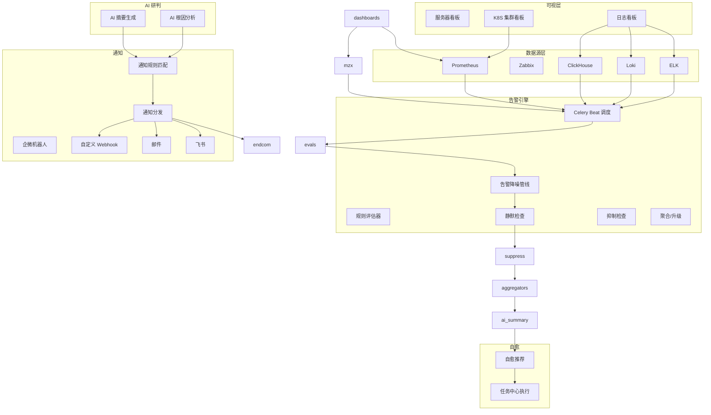
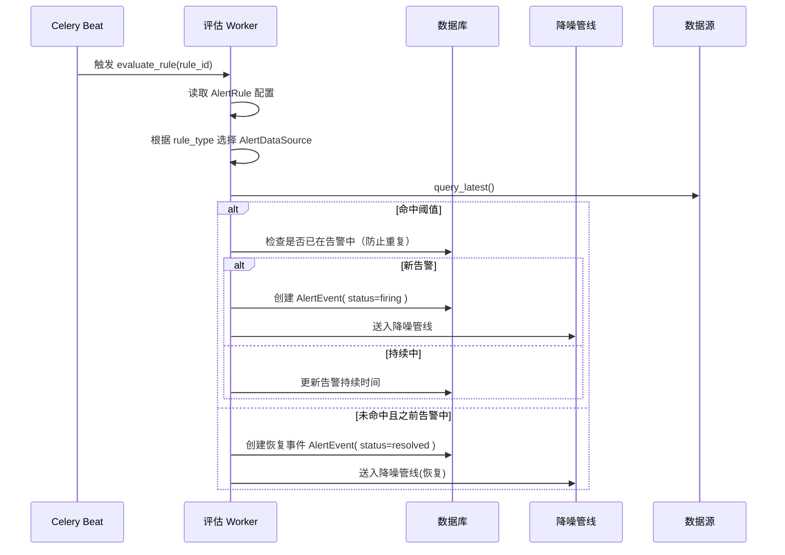
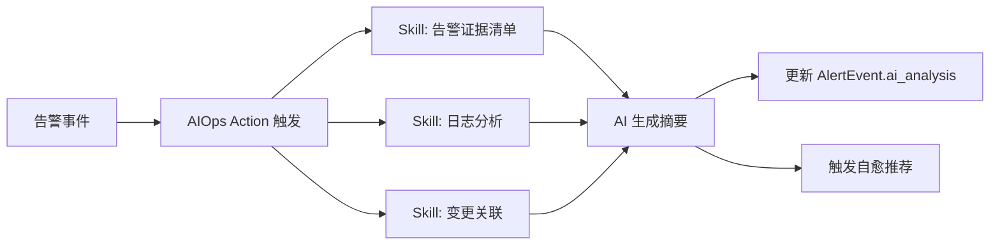
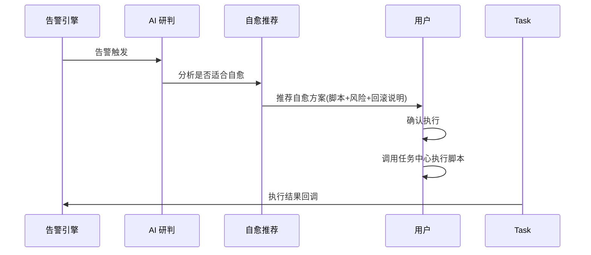
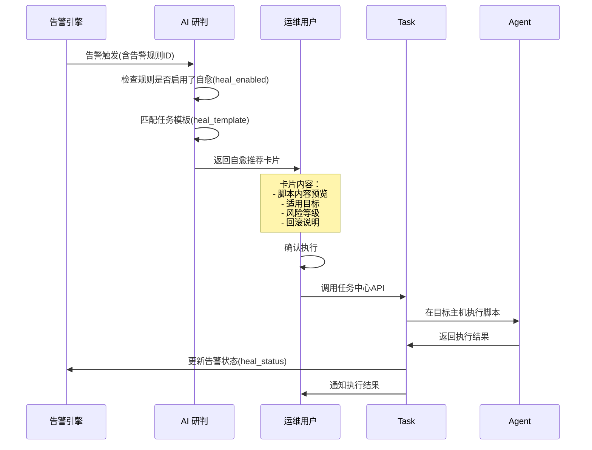

# XingCloud 可观测性告警引擎 — 概要设计

## 1. 设计目标

基于现有可观测性底座，参考 Nightingale v6 告警引擎架构，建设一套**多数据源统一告警引擎**，覆盖指标、日志、K8S、SLA 等场景，集成 AI 研判、告警自愈和灵活的降噪/通知编排。

### 核心目标

| # | 目标 | 说明 |
|---|------|------|
| 1 | 统一告警评估层 | 屏蔽 Prometheus / Zabbix / ELK / Loki / ClickHouse 差异，告警规则统一配置和评估 |
| 2 | 低延迟轮询 + 事件驱动 | 基于 Celery Beat + Redis Stream 的混合调度，分钟级指标告警、准实时日志告警 |
| 3 | 内置降噪管线 | 静默 / 抑制 / 聚合 / 升级 四阶段告警降噪，可插拔处理器 |
| 4 | AI 研判集成 | 复用现有 AIOps Action/Skill 体系，告警触发后自动调用 AI 根因分析和建议 |
| 5 | 告警自愈 | 对接现有任务中心 (ops/task)，告警触发后可执行预定义脚本完成自愈 |
| 6 | 预构建集成 | 内置 Linux、K8S、MySQL、Redis、Kafka、Nginx 开箱即用规则包和仪表盘 |
| 7 | 通知编排 | 企业微信机器人、飞书、邮件、自定义 Webhook 四种渠道，支持时间、级别、标签路由 |

---

## 2. 整体架构



---

## 3. 模块设计

### 3.1 数据源适配层

现有 `MetricDataSource` / `LogDataSource` 模型已覆盖连接配置，需新增**告警数据源抽象层**：

```python
# ops/alert/datasource/base.py
class AlertDataSource(ABC):
    """告警数据源基类"""
    
    @abstractmethod
    def query_latest(self, rule: AlertRule) -> list[DataPoint]:
        """查询最新指标/日志数据"""
    
    @abstractmethod
    def query_range(self, rule: AlertRule, start: int, end: int) -> list[DataPoint]:
        """查询历史范围数据"""
    
    @abstractmethod
    def test_connection(self) -> bool:
        """测试数据源连通性"""

class PrometheusDataSource(AlertDataSource): ...
class ZabbixDataSource(AlertDataSource): ...
class LokiDataSource(AlertDataSource): ...
class ElasticsearchDataSource(AlertDataSource): ...
class ClickHouseDataSource(AlertDataSource): ...
```

不同类型告警规则关联不同数据源：

| 告警类型 | 数据源 | 查询方法 |
|---------|--------|---------|
| `prometheus` | Prometheus | PromQL 查询 |
| `zabbix` | Zabbix | Zabbix API host.get/item.get |
| `log_loki` | Loki | LogQL 查询 |
| `log_elk` | ELK | ES DSL 查询 |
| `log_ch` | ClickHouse | SQL 查询 |
| `host_miss` | — | 基于心跳时间判断 |
| `k8s_event` | Prametheus / K8S API | K8S Event 轮询 |
| `sla` | Prometheus / 依赖计算 | SLA 指标计算 |

### 3.2 告警规则模型

在现有 `AlertRule` 基础上扩展字段：

```python
# Ops/alert/models.py (扩展)
class AlertRule(models.Model):
    RULE_TYPE_CHOICES = [
        ('prometheus', 'PromQL 指标'),
        ('zabbix', 'Zabbix 指标'),
        ('log_loki', 'Loki 日志'),
        ('log_elk', 'ELK/ES 日志'),
        ('log_ch', 'ClickHouse 日志'),
        ('host_miss', '主机失联'),
        ('k8s_event', 'K8S 事件'),
        ('sla', 'SLA 看板'),
    ]

    name = models.CharField(max_length=255)
    rule_type = models.CharField(max_length=32, choices=RULE_TYPE_CHOICES)
    datasource = models.ForeignKey('MetricDataSource', ..., null=True, blank=True)
    log_datasource = models.ForeignKey('LogDataSource', ..., null=True, blank=True)

    # 查询配置 — 根据规则类型解释不同
    promql = models.TextField(blank=True)               # prometheus 类型使用
    logql = models.TextField(blank=True)               # loki 类型使用
    es_dsl = models.JSONField(null=True, blank=True)   # ELK 类型使用
    ch_sql = models.TextField(blank=True)               # ClickHouse 类型使用
    zabbix_key = models.CharField(max_length=255, blank=True)

    # 触发条件
    severity = models.IntegerField(default=2)   # 1-致命 / 2-警告 / 3-信息
    duration = models.IntegerField(default=60)  # 持续秒数
    condition = models.CharField(max_length=16)  # gt/lt/eq/neq
    threshold = models.FloatField()
    target_filter = models.JSONField(null=True, blank=True)  # 标签过滤

    # 调度
    eval_interval = models.IntegerField(default=60)  # 评估间隔(秒)
    enable = models.BooleanField(default=True)

    # 自愈
    task_template = models.ForeignKey('ops.TaskTemplate', null=True, blank=True)
    heal_enabled = models.BooleanField(default=False)

    # 业务归属
    busi_group = models.ForeignKey('BusiGroup', on_delete=models.CASCADE)

    created_at = models.DateTimeField(auto_now_add=True)
    updated_at = models.DateTimeField(auto_now=True)
```

### 3.3 告警引擎 — 调度与评估

使用 Celery Beat + Redis 实现混合调度：



**具体实现要点：**

- 每个 `AlertRule.eval_interval` 注册一个 Celery Beat 周期性任务
- 使用 Redis 中的 `alert:active:{rule_id}` 标记当前是否已在告警状态，避免重复产生事件
- 支持 `for`（持续时长）语义：指标需连续超过阈值 N 秒才触发
- worker 池建议使用 `celery pool=gevent` 或 `prefork` 以支持多数据源并发查询

### 3.4 告警事件模型

```python
class AlertEvent(models.Model):
    STATUS_CHOICES = [
        ('firing', '告警中'),
        ('resolved', '已恢复'),
    ]

    rule = models.ForeignKey(AlertRule, on_delete=models.CASCADE)
    rule_name = models.CharField(max_length=255)
    status = models.CharField(max_length=16, choices=STATUS_CHOICES)
    severity = models.IntegerField()

    # 触发时的实际值
    trigger_value = models.FloatField(null=True)
    trigger_time = models.DateTimeField(db_index=True)
    resolved_at = models.DateTimeField(null=True, blank=True)

    # 标签信息
    tags = models.JSONField(default=dict)
    target_ident = models.CharField(max_length=128, blank=True)

    # 降噪管线处理结果
    is_muted = models.BooleanField(default=False)
    is_inhibited = models.BooleanField(default=False)
    aggregation_key = models.CharField(max_length=64, blank=True)
    escalated = models.BooleanField(default=False)

    # AI 研判
    ai_summary = models.TextField(blank=True)
    ai_analysis = models.JSONField(null=True, blank=True)

    created_at = models.DateTimeField(auto_now_add=True)
```

### 3.5 降噪管线

参考 Nightingale 的 pipeline 模式，使用**可配置的责任链**：

```python
class AlertPipeline:
    processors = [MuteProcessor, SuppressProcessor, AggregateProcessor]

    def process(self, event):
        chain = event
        for processor in self.processors:
            event = processor.handle(event)
            if event.is_dropped:
                break
        return alevent
```

| 处理器 | 职责 | 配置来源 |
|--------|------|---------|
| `MuteProcessor` | 检查是否在静默窗口内 | `AlertMuteRule`（时间/标签匹配） |
| `SuppressProcessor` | 高优先级告警抑制低级告警 | `AlertSuppressRule`（基于严重级别和来源） |
| `AggregateProcessor` | 同类告警聚合为一条 | 按 `aggregation_key`（规则+标签组合）聚合 |
| `EscalateProcessor` | 若长时间未恢复则升级 | 配置升级时间阈值和严重级别 |

**通知只在降噪管线通过后才进行。**

### 3.6 AI 研判集成

复用已有 AIOps 体系的 Action/Skill 机制，不需要重新实现 LLM 调用：



**AI 研判触发时机：**

- **P0**：告警产生后异步调用 AIOps 进行摘要生成（`ai_summary`），写入 `AlertEvent`
- **P1**：用户点击"分析"按钮时触发根因分析（`ai_root_analysis`），调用 `Action.alert.root_cause`

### 3.7 告警自愈



**核心设计：**

- 自愈不**默认执行**，需用户确认（遵循现有 AIOps 2.0 设计原则）
- `AlertRule.heal_template` 关联任务中心模板
- AI 研判输出自愈推荐卡片（`block.self_heal_recommendation`）
- 用户点击"确认执行"→ 任务中心创建执行记录 → 异步回调更新告警状态

### 3.8 通知规则引擎

复用现有 `AlertNotificationRule` 模型，扩展规则匹配能力：

```python
class AlertNotificationRule(models.Model):
    name = models.CharField(max_length=255)
    busi_group = models.ForeignKey('BusiGroup', on_delete=models.CASCADE)

    # 匹配条件
    severity = models.CharField(max_length=32, blank=True)       # 1,2,3 或组合
    match_tags = models.JSONField(null=True, blank=True)       # 标签匹配
    match_rule_ids = models.JSONField(null=True, blank=True)   # 指定规则

    # 时间调度
    time_ranges = models.JSONField(null=True, blank=True)
    # [{"day_of_week":"1-5","start":"09:00","end":"18:00"}]

    # 路由配置
    channels = models.JSONField()  
    # [{"type":"wecom_robot","config":{"webhook_url":"..."}},
    #  {"type":"feishu","config":{"webhook_url":"..."}},
    #  {"type":"email","config":{"addresses":["..."]}},
    #  {"type":"webhook","config":{"url":"...","headers":{}}}]

    # 模板
    message_template = models.ForeignKey('MessageTemplate', ..., null=True)
```

**通知分发逻辑：**

1. 降噪管线处理完的告警事件
2. 按 `busi_group` + 匹配条件过滤通知规则
3. 命中的规则获取 `channels`，调用对应发送器
4. 发送器使用 `message_template` 渲染消息，推送到目标

### 3.9 预构建集成包

| 集成目标 | 规则数量 | 仪表盘 | 数据源依赖 |
|---------|---------|--------|-----------|
| Linux 主机 | 8 | 服务器看板(CPU/内存/磁盘/网络) | Prometheus(node_exporter) |
| K8S 集群 | 12 | K8S 集群看板(Pod/Node/集群事件) | Prometheus(kube-state-metrics) |
| MySQL | 8 | MySQL 看板(连接数/QPS/慢查询) | Prometheus(mysqld_exporter) |
| Redis | 6 | Redis 看板(内存/命中率/延迟) | Prometheus(redis_exporter) |
| Kafka | 6 | Kafka 看板(消费延迟/分区) | Prometheus(jmx_exporter) |
| Nginx | 4 | Nginx 看板(请求量/错误率/延迟) | Prometheus(nginx_exporter) |

**实现方式：**

- 在 `integrations/` 目录下定义 JSON/YAML 格式的集成包
- 每个包包含：告警规则定义（PromQL/阈值）、仪表盘 JSON、变量说明
- 用户通过"集成中心"一键导入规则和仪表盘

---

## 4. 可视化仪表板

### 4.1 服务器看板

| 面板 | 数据源 | 说明 |
|------|--------|------|
| CPU 使用率概览 | Prometheus | `100 - (avg by (instance) (rate(node_cpu_seconds_total{mode="idle"}[5m])) * 100)` |
| 内存使用率 | Prometheus | `(1 - node_memory_MemAvailable_bytes / node_memory_MemTotal_bytes) * 100` |
| 磁盘使用 TOP5 | Prometheus | `topk(5, 100 - (node_filesystem_avail_bytes / node_filesystem_size_bytes) * 100)` |
| 网络流量 | Prometheus | `rate(node_network_receive_bytes_total[5m])` |

### 4.2 K8S 集群看板

| 面板 | 数据源 | 说明 |
|------|--------|------|
| 集群节点状态 | Prometheus | `kube_node_status_condition{condition="Ready",status="true"}` |
| Pod 状态分布 | Prometheus | `count by (namespace, phase) (kube_pod_status_phase)` |
| 集群 CPU/内存使用 | Prometheus | 节点维度资源使用率聚合 |
| 集群事件 | K8S API | 异常事件滚动展示 |

### 4.3 日志看板

| 面板 | 数据源 | 说明 |
|------|--------|------|
| 日志量时序 | Loki/ELK/CH | 按时间聚合日志条数 |
| 错误日志趋势 | Loki/ELK/CH | `level=error` 的时间分布 |
| Top N 错误 | ELK | ES terms aggregation |
| 日志来源分布 | ClickHouse | 按namespace/service聚合统计 |

---

## 5. 接口清单

| 类型 | 接口 | 方法 |
|------|------|------|
| 告警规则 | `/api/alert-rules/` | CRUD |
| 告警规则 | `/api/alert-rules/{id}/test/` | POST（测试运行） |
| 告警事件 | `/api/alert-events/` | GET（当前告警） |
| 告警事件 | `/api/alert-events/history/` | GET（历史告警） |
| 告警事件 | `/api/alert-events/{id}/ai-analysis/` | POST（触发AI分析） |
| 静默规则 | `/api/alert-mute-rules/` | CRUD |
| 抑制规则 | `/api/alert-suppress-rules/` | CRUD |
| 通知规则 | `/api/alert-notification-rules/` | CRUD |
| 通知规则 | `/api/alert-notification-rules/{id}/test/` | POST（测试通知） |
| 通知记录 | `/api/alert-notification-records/` | GET |
| 集成中心 | `/api/integrations/` | GET（列出可用集成包） |
| 集成中心 | `/api/integrations/{slug}/install/` | POST（导入规则和仪表盘） |

---

## 6. 自愈流程



---

## 7. 边界范围

### 本次范围

- 指标数据源：Prometheus、Zabbix
- 日志数据源：ELK、Loki、ClickHouse
- 告警类型：PromQL / Zabbix / 日志 / 主机失联 / K8S 事件 / SLA
- 通知渠道：企微机器人、飞书、邮件、自定义 Webhook
- 预置集成：Linux、K8S、MySQL、Redis、Kafka、Nginx
- 仪表盘：服务器看板、K8S 集群看板、日志看板（基于已有原生看板扩展）
- AI 研判：复用现有 AIOps Action/Skill 体系
- 告警自愈：推荐 → 确认 → 执行 → 回调

### 本次不包含

- 链路追踪（Jaeger/SkyWalking/Tempo）—— 已从产品边界移除
- 外部系统反向写入告警 —— 建议走事件中心
- Jaeger / Zipkin 等数据源接入
- 通知渠道扩展（短信/语音/电话）— 如有需要后续加入

---

## 8. 实施建议

| 阶段 | 内容 | 预估工作量 |
|------|------|-----------|
| P0 | 告警规则模型 + 数据源抽象 + Celery Beat 调度 + PromQL/Zabbix 评估 | 2-3 人周 |
| P0 | 告警事件模型 + 降噪管线（静默/抑制/聚合） | 1-2 人周 |
| P0 | 通知规则引擎 + 四种渠道发送器 | 1-2 人周 |
| P0 | AI 研判触发（复用 AIOps Action 调用链） + 自愈推荐 | 1 人周 |
| P1 | LogQL/ES/CH 日志告警规则评估 | 2 人周 |
| P1 | 预置集成包（6 个） | 1-2 人周 |
| P1 | 服务器看板 / K8S 看板 / 日志看板 | 1-2 人周 |
| P2 | 告警升级 + 聚合视图 + 告警统计 | 1 人周 |
| P2 | 自愈执行闭环（确认 → 任务中心 → 回调） | 1 人周 |