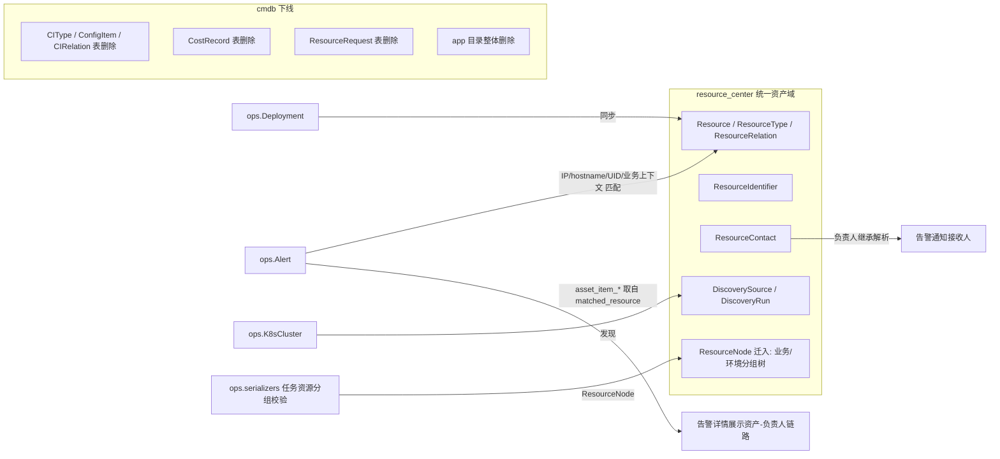

# 资产中心合并与 CMDB 下线方案

状态：**已实施（2026-08-05，代码完成、后端 345 用例与前端 build 全绿；待部署）**
关联文档：`docs/资源中心设计与迁移.md`（第一轮：数据统一到 Resource）、`docs/Alert-Closure-Improvement-Plan.md`（告警闭环，资源关联以本方案为前置）、`docs/FY24-鲸眼告警中心V3.x产品整体介绍v1.0(1).pdf`（对标参考：告警丰富/自动分派/CMDB 业务聚合）

## 1. 背景与目标

第一轮迁移（提交 9c70e06）已把配置项数据统一到 `resource_center.Resource`（含稳定标识、自动发现、负责人、关系、运行时索引）。但 `cmdb` app 的代码与数据表仍然存在，形成双体系：

- `resource_center`：能力完整（Resource/ResourceType/ResourceRelation/联系人/发现），已挂载 `api/resource-center/`，前端唯一资产页面（ResourceCenter.vue）使用它。
- `cmdb`：6 个模型、4 组 API 视图仍存在，但**根路由从未挂载 cmdb 的 URL**（`/api/cmdb/*` 全部 404），前端 `cmdb.js` 已是死端点。

**资产中心定位（用户确认）**：核心使命是"**根据告警的 IP、业务标签、告警源等信息找到对应的负责人**"（对标鲸眼告警中心：CMDB 丰富 → 自动分派联动 CMDB 实例/业务负责人）。据此**瘦身合并**：

- 成本（CostRecord、成本报表、优化建议、成本仪表盘）与资源申请（ResourceRequest 审批流）**全部砍掉**，不迁入。
- `ResourceNode` 业务/环境分组树**保留并迁入**资源中心（支撑"业务标签"维度；ops 任务资源分组校验依赖它）。
- `CIType/ConfigItem/CIRelation/CostRecord/ResourceRequest` 五表**随 cmdb 直接下线**。
- cmdb app **单轮整体删除**（不留空壳）。
- 告警负责人解析沿用现有维度（IP/hostname/UID/业务上下文），**只强化告警详情的资产-负责人链路展示**，不动 `alert_matching` 匹配逻辑。

## 2. 决策记录（2026-08-05 用户确认）

| 维度 | 决策 |
|---|---|
| 交付形态 | 先出设计文档，评审通过后再编码 |
| 迁移策略 | 原地改造旧表（回滚依赖全库备份恢复） |
| 字段命名 | 告警详情 `cmdb_item_*` → `asset_item_*`（顺带改名，Deployments.vue 两处同步） |
| app 下线 | 单轮直接下线：移除 INSTALLED_APPS 并删除 `backend/cmdb/` 目录 |
| 成本模块 | **全砍**：CostRecord 不迁入，cost/report、optimization/suggestions、dashboard/stats 端点与 aiops 成本查询全部删除 |
| 资源申请 | **全砍**：ResourceRequest 审批流删除（后续阶段 2 工单如需再设计） |
| 分组树 | **保留迁入**：ResourceNode → resource_center，业务/环境分组树 |
| 负责人解析 | 现有匹配维度够用（IP/hostname/UID/业务上下文），不动 alert_matching，只强化告警详情展示链路 |
| 菜单结构 | 侧边栏单入口 `/resource-center`，不新增子菜单；能力以 ResourceCenter.vue 内部 tab 承载 |
| 权限码 | 保留 `cmdb.ci.view / ci.manage / topology.view`；删除失去功能的 `cmdb.dashboard.view / cost.view / request.submit / request.approve`（含 rbac 数据清理，见 6.2） |

## 3. 范围

### 3.1 做

1. `ResourceNode` 迁入 resource_center（原地改表名，数据不动，含 tree 端点）。
2. 五个模型清理后删除表（删除动作在 resource_center 迁移内完成）：`CIType`、`ConfigItem`、`CIRelation`、`CostRecord`、`ResourceRequest`。
3. 视图迁移：仅 `ResourceNodeViewSet`（tree 端点）迁入 resource_center；成本/申请/仪表盘视图**直接删除**。
4. 告警详情展示强化：告警详情 API 增加"匹配资产 + 负责人链路"展示数据（资产名称/类型/状态 + 联系人角色/接收人，数据源 matched_resource 与现有 ResourceContact 解析），前端 Alerts 详情同步展示。
5. 引用改向：ops/aiops/测试中对 cmdb 模型的 import 全部改向；`ops.serializers.py` 告警详情字段 `cmdb_item_*` 改名为 `asset_item_*`，数据源改为 `matched_resource`。
6. 前端：`cmdb.js` 中 nodes 相关函数前缀改指 `/resource-center/`，成本/申请/仪表盘函数**删除**；Deployments.vue 两处字段改名；告警详情展示资产-负责人链路。
7. `clear_legacy_asset_data` 只保留 MiddlewareAsset 清理；新增 `clear_legacy_cmdb_data`（清 ConfigItem/CIRelation，迁移前置）。
8. **cmdb app 直接下线**：INSTALLED_APPS 移除、`backend/cmdb/` 目录整体删除；rbac 清理 4 个失效权限码。
9. 后端相关测试改造 + 新增合并回归测试；前端 build 验证。

### 3.2 不做（边界）

- 不合并 ops 域资产（Host / MiddlewareAsset / TaskResource / K8sCluster / Deployment 同步）：第一轮已决策与资源中心保持各自事实源。
- 不改 `Resource`/`ResourceIdentifier`/`Discovery*` 模型结构与 `alert_matching` 匹配逻辑。
- 不做成本能力增强、资源申请再造、阶段 2 工单打通（后续轮次）。
- **不新增侧边栏子菜单**：资产能力以 `ResourceCenter.vue` 内部 tab 承载，菜单保持单一入口 `/resource-center`。
- 不动 `ops.Host` 与主机凭据。
- 不做鲸眼 PPT 的"对象模型/CMDB 丰富策略配置"新功能（ResourceType + alert_matching 已覆盖同等能力，仅展示层强化）。

## 4. 目标架构



## 5. 模型与数据迁移设计

### 5.1 模型处置

| cmdb（旧） | 处理 | 说明 |
|---|---|---|
| `cmdb_citype` | **删除表** | 能力已由 ResourceType 覆盖 |
| `cmdb_configitem` | **删除表** | 第一轮已迁入 Resource（identifier 匹配） |
| `cmdb_cirelation` | **删除表** | 第一轮已迁入 ResourceRelation |
| `cmdb_resourcenode` | **原地改表名迁入** | `resource_center_resourcenode`（字段不变：name/node_type/parent/sort_order） |
| `cmdb_costrecord` | **删除表** | 成本功能全砍（数据随备份保留，不迁入） |
| `cmdb_resourcerequest` | **删除表** | 申请功能全砍 |

### 5.2 迁移编排（单轮，单个迁移文件 `resource_center/migrations/0005_merge_cmdb.py`）

```
resource_center/migrations/0005_merge_cmdb.py
    ├─ SeparateDatabaseAndState ×1（state_operations: CreateModel(ResourceNode)）
    ├─ RunPython: adopt_or_create_resource_node（物理表处理）
    └─ RunPython: validate_and_drop_cmdb_tables（校验 + DROP 五表）
```

**为什么不用 CreateModel 直接建表**：`cmdb_resourcenode` 物理上已存在，直接 CreateModel 会因表已存在失败；而 cmdb app 的迁移文件本轮即删除，无法借道 cmdb 迁移删表。因此所有物理操作以 RunPython 执行，state 用 `SeparateDatabaseAndState` 注册：

1. **adopt_or_create（ResourceNode）**：按 `information_schema.tables`（SQLite 用 `sqlite_master`，兼容测试库）判断旧表存在性：
   - 旧表存在（线上升级路径）→ `RENAME TABLE cmdb_resourcenode TO resource_center_resourcenode`（数据原位不动；SQLite 用 `ALTER TABLE ... RENAME TO`）。
   - 旧表不存在（全新库路径）→ `schema_editor.create_model(model)` 建新表（DDL 与迁移一致）。
   - 实现要点：RunPython 必须放在 `SeparateDatabaseAndState` **之外**（作为独立 operation），否则 `apps.get_model('resource_center', 'ResourceNode')` 拿到的是 state 更新前的版本会抛 LookupError（database_operations 运行在 state_operations 生效之前）。
2. **validate_and_drop_cmdb_tables**：
   - 原生 SQL `SELECT COUNT(*) FROM cmdb_configitem / cmdb_cirelation`（物理表查询，不依赖 ORM state——cmdb 迁移文件已删，`apps.get_model('cmdb', ...)` 不可用）；计数非 0 抛异常中止，提示先执行 `python manage.py clear_legacy_cmdb_data --confirm`。
   - 表不存在（全新库）→ 跳过（`DROP TABLE IF EXISTS` 幂等）。
   - 删除顺序（引用关系优先）：`cmdb_cirelation` → `cmdb_configitem` → `cmdb_costrecord`（FK 引用 configitem）→ `cmdb_resourcerequest` → `cmdb_citype`。

**与既有迁移历史的关系**：`ops/migrations/0060_remove_seeded_demo_data.py` 以 `_safe_get_model(apps, 'cmdb', ...)` 安全包装访问 cmdb 模型（容错返回 None），且已应用，不构成依赖；grep 确认无任何其他 app 迁移在 `dependencies` 中引用 cmdb 迁移。**删除 cmdb 迁移文件不破坏 Django 迁移图**。

### 5.3 迁移后校验清单

```sql
SHOW TABLES LIKE 'resource_center_resourcenode';    -- 存在，行数与迁移前一致
SHOW TABLES LIKE 'cmdb_%';                          -- 无任何匹配（五表全删）
SELECT COUNT(*) FROM resource_center_resourcenode;  -- 与迁移前记录一致
```

## 6. API 与权限设计

### 6.1 端点处置

| cmdb 旧端点（未挂载，404） | 处置 | resource_center 新端点 |
|---|---|---|
| `/api/cmdb/resource-nodes/` | **迁入** | `/api/resource-center/nodes/`（ResourceNodeViewSet，tree: cmdb.ci.view，逻辑不变） |
| `/api/cmdb/cost-records/` | **删除**（成本全砍） | — |
| `/api/cmdb/resource-requests/`（approve/reject/complete） | **删除**（申请全砍） | — |
| `/api/cmdb/dashboard/stats/` | **删除** | — |
| `/api/cmdb/topology/data/` | **删除**（rc 已有 `/resource-center/resources/topology/`） | — |
| `/api/cmdb/cost/report/`、`/optimization/suggestions/` | **删除** | — |

- 不保留旧前缀兼容层：旧前缀从未上线，前端无存活调用。
- 告警详情展示强化（新增，非端点迁移）：告警详情序列化在 `asset_item_*` 之外增加 `asset_contacts` 字段（负责人链路：角色/姓名/接收人，由 matched_resource 的 ResourceContact 解析结果提供，复用现有通知解析逻辑）；无匹配时返回空列表。

### 6.2 RBAC

- **保留**：`cmdb.ci.view`（查看资源中心）、`cmdb.ci.manage`（管理资源中心）、`cmdb.topology.view`（查看资源关系）。
- **删除**：`cmdb.dashboard.view`、`cmdb.cost.view`、`cmdb.request.submit`、`cmdb.request.approve`（随功能下线）。
- 实施：`rbac/registry.py` 移除 4 个权限码定义与内置角色绑定；新增 rbac 数据迁移删除 `PermissionDefinition` 中对应记录（及角色关联）。风险与回滚见 §12。
- 保留权限码的文案微调：`cmdb.ci.view` 名称已是"查看资源中心"，无需改。

## 7. 前端改造

### 7.1 `src/api/modules/cmdb.js` 整体删除

- **实施结论**：`cmdb.js` 无存活调用者（nodes 4 函数仅有定义无引用；CITypes/ConfigItems/CIRelations/CostRecords/ResourceRequests/Dashboard 系列仅被死组件使用），**整体删除文件**；nodes 4 函数移入 `resourceCenter.js`（前缀 `/resource-center/`）。
- 随 cmdb.js 删除的死组件：`CmdbTopologyPanel.vue`、`CmdbTopologyCanvas.vue`、`useTopologyGraph.js`、`CmdbRequestsPanel.vue`（grep 确认无引用者）。
- 确认无其他模块引用被删函数（grep 断言）。

### 7.2 字段改名

- 后端 `ops/serializers.py`：`cmdb_item_id/cmdb_item_name/cmdb_item_status/cmdb_targets` → `asset_item_id/asset_item_name/asset_item_status/asset_targets`（SerializerMethodField 名、get_ 方法与 fields 列表同步）。
- 前端 `src/views/Deployments.vue:402-403` 两处展示同步改名。
- 数据源切换：`matched_resource`（见 §8），字段语义不变。

### 7.3 告警详情资产-负责人链路展示（定位核心）

- 后端：告警详情序列化新增 `asset_contacts`（见 6.1）。
- 前端：Alerts 详情面板增加"匹配资产 / 负责人"区块（资产名、类型、状态 + 联系人角色列表），无匹配时展示空态提示（可跳转资源中心补录）。

### 7.4 菜单与页面结构（维持单入口，不建子菜单）

- 侧边栏维持现状：`moduleKey: 'assets'` 下唯一子项 `/resource-center`（title 资源中心，permission `cmdb.ci.view`）。
- 合并后能力承载：资源清单/分组树/自动发现/发现历史/资源关系 5 个 tab，均在 `ResourceCenter.vue` 内（"分组树"tab 本轮已实现：树形表格 + 新增业务线/加环境/编辑/删除，权限 `cmdb.ci.manage`）。
- `MiddlewareAssets.vue`（孤岛页面）与 `/assets/*` 重定向不在本轮范围。

### 7.5 验证

`npm run build` 通过；grep 断言：`cmdb.js` 无 `/cmdb/` 残留、`frontend/src` 无 `cmdb_item` 残留、无对已删除 api 函数的引用。

## 8. 引用清理清单（后端）

| 文件 | 现状 | 改法 |
|---|---|---|
| `ops/serializers.py:10` | import CIRelation/ConfigItem/ResourceNode | ResourceNode → resource_center.models；CIRelation/ConfigItem 改由 Resource 提供（见下） |
| `ops/serializers.py:1257-1396` | 告警 `cmdb_item_*` 4 字段读 ConfigItem/CIRelation | **改名为 `asset_item_*`**，数据源改 `obj.matched_resource`：id/name/status 直读，`asset_targets` 读 matched_resource 的 runs_on 关系目标 |
| `ops/serializers.py:183-189, 1426-1431, 1523-1528` | ResourceNode 业务/环境分组校验 | import 改向，逻辑不变 |
| `ops/serializers.py`（告警详情） | — | 新增 `asset_contacts` 字段（负责人链路） |
| `aiops/services.py:28, 4277, 8445, 12453, 12469` | ConfigItem 查询（AI 助手资产检索、目标定位） | 改查 `resource_center.Resource`（按 name/identifier 匹配，字段映射对齐原 CI 查询语义） |
| `aiops/services.py:4638-4640` | `from cmdb.views import _cost_rows_for_month` | **删除**（成本查询能力下线） |
| `ops/tests.py:16, 2520-2521`、`ops/test_deployments.py:8, 28-31`、`ops/test_transaction_tickets.py:5, 14-16` | ResourceNode import | 改向 resource_center.models |
| `ops/cmdb_stub.py` | 空壳 stub（ConfigItem/ResourceNode/CIRelation） | 删除文件（确认无引用后） |
| `resource_center/management/commands/clear_legacy_asset_data.py:4` | CIRelation/ConfigItem 清理 | 命令改为只处理 MiddlewareAsset；新增 `clear_legacy_cmdb_data`（只清 cmdb_configitem/cmdb_cirelation，预览/确认两段式），供迁移前清存量 |
| `rbac/registry.py:42-48, 105-142` | 7 个权限码与角色绑定 | 移除 4 个失效码（dashboard/cost/request.*）及角色绑定；新增 rbac 数据迁移清理 PermissionDefinition |
| `settings.py:354` INSTALLED_APPS | `'cmdb'` | 移除 |
| `settings.py:289` `ENABLE_LEGACY_CMDB_SYNC` 与 `cmdb/apps.py` 信号 | 回滚开关 | 随 app 删除（ConfigItem 表已删，开关失去意义） |
| `backend/cmdb/` 目录 | models/views/urls/signals/sync/tests/migrations | **整体删除**（ops/0060 的 cmdb 访问是 `_safe_get_model` 容错包装，不构成依赖） |

## 9. 发布顺序与回滚

### 9.1 发布顺序（单轮）

1. **全库备份**：`mysqldump --single-transaction --set-gtid-purged=OFF <db> > backup_before_merge.sql`（不可逆改造，备份是唯一回滚手段，必须校验可恢复）。
2. （可选，仅当 ConfigItem/CIRelation 有存量）执行 `python manage.py clear_legacy_cmdb_data --confirm`。
3. 部署代码：cmdb 目录删除、INSTALLED_APPS 移除、rbac 清理、引用改向、`resource_center/migrations/0005_merge_cmdb.py` 就位。
4. `python manage.py migrate`（ResourceNode 迁入 + 五表删除 + rbac PermissionDefinition 清理）。
5. 校验：`showmigrations` 全 `[X]`；执行 5.3 校验 SQL；抽查 `/api/resource-center/nodes/` tree 端点；确认 `/api/cmdb/*` 404。
6. 验证告警详情 `asset_item_*` 与 `asset_contacts` 有值；Deployments.vue 展示正常。
7. 前端构建部署（cmdb.js 瘦身 + 字段改名 + 告警详情资产区块）。
8. 确认角色权限页不再出现已删权限码。

### 9.2 回滚

- 迁移不可逆（表删除 + rbac 数据清理），回滚路径 = **恢复备份**：`mysql < backup_before_merge.sql` + 回退代码版本。
- 前端回滚：git revert 前端提交即可。
- cmdb app 已整体删除，无"部分回滚"中间态。

## 10. 测试计划

### 10.1 新增（已实施，resource_center/tests.py、ops/tests.py）

1. `ResourceNode`：tree 端点结构、biz/env 层级、CRUD 流程（含删除级联）、权限（无 cmdb.ci.view 时 403）——`ResourceNodeApiTests`。
2. 告警序列化：`asset_contacts` 与 `asset_recipient_names` 字段——matched_resource 存在且有负责人时有值、无匹配时为空列表——`AlertAssetContactsTests`（ops/tests.py）。
3. rbac：4 个失效权限码随迁移删除（registry 与数据迁移）。
4. **迁移双路径冒烟**（已手动验证，未入测试套件）：全新库（无 cmdb 表）迁移成功建表；存量库（预置 cmdb_resourcenode + 数据 + cmdb_configitem 空表）迁移 rename 保留数据 + 删表成功（临时 SQLite 验证脚本）。

### 10.2 改造（已实施）

- `ops/tests.py`、`ops/test_deployments.py`、`ops/test_transaction_tickets.py`：ResourceNode import 改向。
- `cmdb/tests.py`：随 app 删除。
- `aiops/services.py`：成本查询（query_cost_report）整体删除。

### 10.3 回归（已通过）

- `cd backend && python manage.py test` 全绿（**345 用例**）。
- `cd frontend && npm run build` 通过；grep 断言：`frontend/src` 无 `cmdb_item` 残留、无 `from '@/api/modules/cmdb'` 引用。

## 11. 验收标准

1. 数据库：`resource_center_resourcenode` 存在且行数一致；`cmdb_%` 无任何表残留。
2. API：`/api/resource-center/nodes/`（含 tree）可用；`/api/cmdb/*` 404；成本/申请/仪表盘端点不存在。
3. RBAC：仅存 `cmdb.ci.view / ci.manage / topology.view` 三个码，角色绑定同步；权限管理页无失效码。
4. 告警详情：`asset_item_*` 与 `asset_contacts` 展示正确（有匹配有值、无匹配空态）；Deployments.vue 展示正常；无 `cmdb_item` 残留。
5. 代码库：`backend/cmdb/` 目录不存在；INSTALLED_APPS 无 cmdb；grep 无 `from cmdb` / `import cmdb`。
6. 前端：build 通过；`cmdb.js` 无 `/cmdb/` 残留、无对已删函数的引用；资源中心页面功能回归正常。
7. 测试全绿；人工验证路径：告警详情资产-负责人链路 + 分组树编辑 + 通知按负责人路由验证。

## 12. 风险与边界

| 风险 | 影响 | 缓解 |
|---|---|---|
| ConfigItem 仍有存量数据时删表 | 数据丢失 | `validate_and_drop_cmdb_tables` 原生 SQL 计数非 0 即中止；发布顺序第 2 步人工清理 |
| 成本/申请数据随删表丢失 | 历史数据不可查 | 用户已确认全砍；备份先行，需要时可从备份导出 |
| rbac 权限码清理不当 | 角色权限错乱或残留 | registry 与数据迁移同步实施；发布第 8 步人工确认；测试 10.1-3 断言 |
| 告警 `asset_item_*`/`asset_contacts` 切换数据源后无值 | 告警详情资产信息缺失 | 匹配规则对齐 matched_resource（与第一轮 identifier 匹配同源）；验收标准 4 覆盖 |
| 删除 cmdb 迁移文件破坏迁移图 | migrate 失败 | 已验证无 dependencies 引用（ops/0060 为容错包装）；showmigrations 校验 |
| 全新库环境迁移失败（RENAME 表不存在） | 新环境部署中断 | adopt_or_create 按 information_schema 判存在：rename 或 create_model，双路径测试覆盖 |
| AI 助手资产检索行为变化 | 回答资产信息不准 | 字段映射对照表写入代码注释；回归 AIOps 资产查询用例 |
| 前端删函数被其他模块引用 | 构建/运行报错 | 7.5 grep 断言 + build 验证 |
