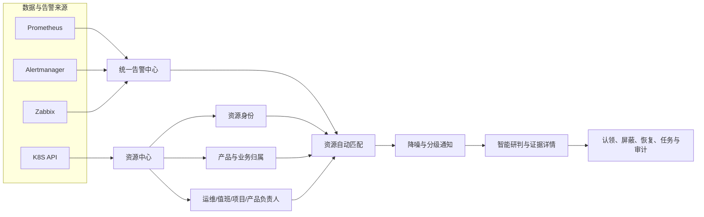
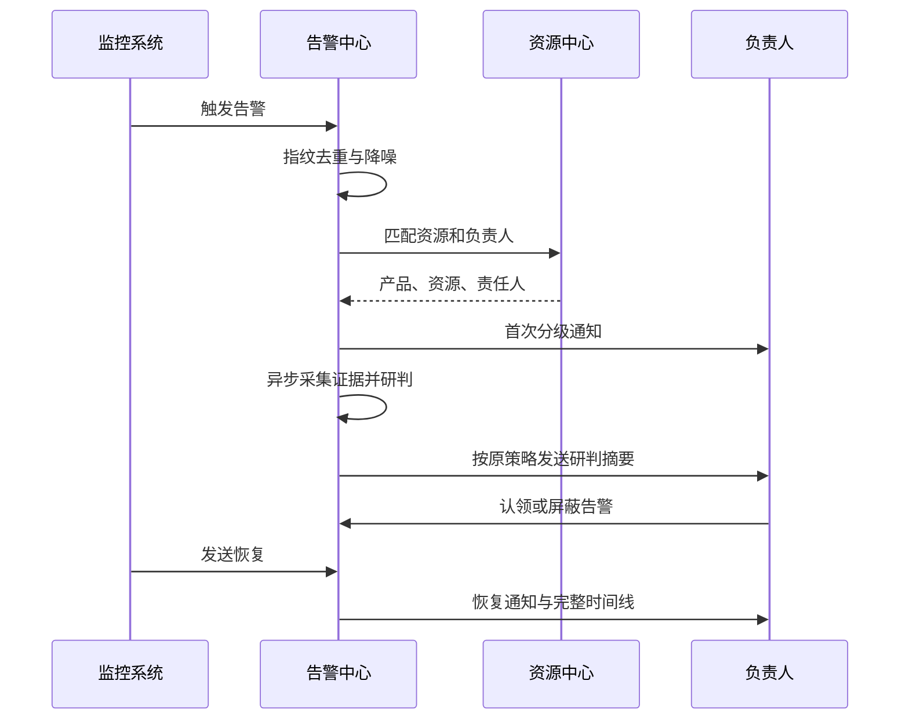

# 数智平台资源与告警一体化建设汇报

> 汇报主题：以统一资源底座支撑外部告警接入、自动分派和智能处置闭环
>
> 汇报对象：管理层、产品负责人、研发负责人、运维负责人
>
> 详细方案：[资源中心总体设计与迁移方案](资源中心设计与迁移.md)、[外部告警接入、资源关联与通知路由方案](外部告警接入方案.md)

## 一、建设目标

数智平台本阶段重点解决两个核心问题：

1. **资源是谁、属于哪个产品、由谁负责。**
2. **告警从哪里来、影响什么、应该通知谁、如何完成闭环。**

平台以资源中心作为统一资源事实源，以告警中心作为统一事件处理入口，形成：

```text
资源登记与自动发现
→ 外部/平台告警统一接入
→ 自动匹配产品与负责人
→ 分级通知与告警降噪
→ 智能研判与处置协同
→ 恢复、审计和复盘
```

## 二、为什么要建设

当前企业监控通常由统一 Zabbix、多个 Prometheus/Alertmanager 和不同业务群共同组成，存在以下典型问题：

| 现状问题 | 直接影响 |
| --- | --- |
| 资产分散在不同系统 | 同一资源信息不一致，负责人和归属难以统一 |
| 一个 Zabbix 覆盖多个产品 | 无法按告警源直接确定产品和负责人 |
| 告警只有 IP、实例或 Pod | 接收人需要人工判断影响对象，再层层转发 |
| Warning 与 Critical 通知混在一起 | 普通告警打扰多，严重告警触达不够强 |
| 告警、研判和处置分散 | 是否通知、谁在处理、为何恢复难以追踪 |
| Pod 等动态对象变化快 | 如果全部当资产登记，会造成台账膨胀和失真 |

建设重点不是再做一套监控采集系统，而是将已有监控能力纳入统一的资源和告警治理体系。

## 三、总体方案



方案由两个平台底座组成：

- **资源中心**回答“资源是谁、属于谁、负责人是谁”。
- **告警中心**回答“发生了什么、是否重复、通知谁、如何处理”。

两者通过稳定资源标识连接，业务上下文不再作为所有功能的全局前置条件。

## 四、资源中心建设重点

### 4.1 从资产台账升级为资源事实源

资源中心统一管理：

- 产品、业务系统、应用服务。
- 物理机、虚拟机。
- K8S 集群和节点。
- MySQL、PostgreSQL。
- Redis、Kafka、RocketMQ。
- 资源归属、重要级别、负责人和长期关系。

平台通过资源 UUID、K8S UID、Zabbix Host ID、IP 和精确端点等标识保持资源身份稳定，避免名称或地址变化造成重复资产。

### 4.2 自动发现与人工治理结合

- K8S 集群在集群管理登记一次，资源中心自动登记集群与所有节点。
- 自动发现持续更新节点状态、版本、容量、IP、标签和最后发现时间。
- 人工维护的产品、负责人和关键字段可锁定，不被自动发现覆盖。
- 发现结果保留新增、更新、未发现、部分成功和失败原因。

当前已启用 K8S 自动发现；Zabbix、Prometheus 和 SSH 发现连接器作为后续扩展，不纳入本阶段已完成范围。

### 4.3 稳定资源与运行时对象分层

Pod、Service、Deployment 等对象变化频繁，平台不将其作为长期资产，而是保存为带过期时间的运行时索引。

这样既能支持 Pod 告警关联、Owner 追溯和研判下钻，又不会让资产台账被短生命周期对象淹没。

## 五、外部告警接入重点

### 5.1 不迁移现有规则即可接入

Alertmanager 和 Zabbix 继续维护原有规则，只需通过独立 Webhook 和 Bearer Token 将告警并行发送到平台。

每个告警源可独立管理：

- 来源名称、类型和负责人。
- 接入地址、Token、限流和启停。
- 字段映射和稳定指纹。
- 通知与智能研判开关。
- 接入量、成功率、拒绝数和最近错误。

### 5.2 一个 Zabbix 可以覆盖多个产品

平台不把“统一 Zabbix”强行绑定某个产品，而是逐条解析告警：

```text
host_ip=10.20.1.35
→ 匹配资源 payment-api-01
→ 补全产品“支付平台”
→ 找到支付运维组、项目负责人
→ 按告警级别发送
```

匹配优先使用 K8S UID、Zabbix Host ID、Pod 运行时索引、精确端点和 IP。只有唯一匹配才自动通知资源负责人；未匹配或冲突时进入诊断状态并使用兜底路由。

### 5.3 外部告警不依赖业务上下文

外部告警可以独立接入、入库、去重和通知。业务上下文仅在智能助手、巡检或精准研判需要组合 Prometheus、日志和 K8S 证据时按功能选择。

这使平台既能服务完整 AIOps 场景，也能作为轻量统一告警处理平台使用。

## 六、负责人自动分派与分级通知

资源中心维护四类角色：运维负责人、值班人员、项目负责人和产品负责人。告警策略可根据级别动态选择负责人和渠道。

推荐通知方式：

| 告警级别/状态 | 建议接收对象 | 建议渠道 |
| --- | --- | --- |
| Info | 平台值班组 | 平台记录或低打扰群 |
| Warning | 资源运维负责人、值班人员 | 飞书/企微业务告警群 |
| Critical | 运维、值班、项目及产品负责人 | 应急群，按需追加语音 |
| 5 分钟未认领 | 告警源负责人或上级升级组 | 升级级别并触发强提醒 |
| 恢复 | 本次活动周期原接收范围 | 恢复通知 |

通知前统一执行静默、抑制、聚合、风暴控制和重复间隔。智能研判跟随原告警策略，不能在告警被降噪后单独发送。

## 七、智能研判与闭环

告警进入平台后，可以异步关联可用的指标、K8S 状态、Warning Event、日志、变更和资源关系，生成证据化研判结果。



平台保留触发、重复、级别变化、研判、通知回执、认领、屏蔽和恢复记录。研判结果不是新的告警，重复提醒附带最近研判摘要，不反复启动模型分析。

## 八、当前建设成果

### 已实现

- 统一资源模型，合并旧资产中心与 CMDB 能力。
- 产品、业务系统、应用、主机、数据库、中间件、K8S 集群和节点管理。
- K8S 集群及节点自动发现、对账、运行时索引和变更记录。
- Prometheus、Alertmanager、Zabbix 统一告警源管理。
- 外部 Webhook、Bearer Token、限流、接入统计和字段映射。
- 告警稳定指纹、资源自动匹配、告警源负责人和资源负责人路由。
- 告警分级通知、降噪、研判、认领、屏蔽、恢复和审计时间线。

### 有限支持

- 外部告警携带的资源标识不足时，只能进入待关联状态并走兜底通知。
- 共享 IP 场景需补充端口、Host ID 或 UID 才能唯一匹配。
- 研判深度取决于平台是否能访问对应指标、K8S 和日志证据。
- 当前自动发现执行器只支持 K8S。

## 九、产品与团队配合事项

为了实现自动分派，各产品负责人需要协同完成：

1. 确认本产品的主机、数据库、中间件和 K8S 集群清单。
2. 补充资源主 IP、端口、Zabbix Host ID 或 K8S 稳定标识。
3. 确认产品、业务系统、环境和重要级别。
4. 维护运维、值班、项目和产品负责人及其有效通知渠道。
5. 确认 Warning、Critical 和超时升级的接收群与升级方式。
6. 选择测试告警，完成触发、重复、升级、研判和恢复验收。

平台团队负责统一接入、规则与指纹标准、资源匹配、通知策略、研判链路和审计能力；各产品团队负责资源归属和责任人信息的准确性。

## 十、预期价值与衡量指标

### 10.1 预期价值

- **统一入口**：多套监控系统告警进入同一平台处理。
- **减少转发**：告警自动找到产品和负责人，降低人工判断成本。
- **降低噪声**：重复、抖动和关联告警按策略合并。
- **强化触达**：不同级别使用不同接收群和升级渠道。
- **缩短定位**：告警详情集中展示资源、证据和研判结论。
- **闭环可审计**：从触发到恢复全程留痕，支撑复盘和管理改进。

### 10.2 核心指标

| 指标 | 管理目标 |
| --- | --- |
| 核心资源纳管率 | 核心产品的主机、集群、数据库和中间件可识别 |
| 负责人完整率 | 核心资源均有可用运维和值班负责人 |
| 告警资源匹配率 | 大部分外部告警能自动补全资源和产品 |
| 告警自动分派率 | 已匹配告警无需人工转发即可触达负责人 |
| 重复告警压缩率 | 同一故障活动周期的重复通知显著减少 |
| 严重告警触达率 | Critical 告警按升级策略触达并获得回执 |
| 平均认领时间 | 告警从触发到负责人认领的时间持续下降 |
| 研判证据完整率 | 关键告警能够关联至少一类有效运行证据 |

## 十一、实施建议

按风险可控、价值优先的顺序推进：

1. **资源治理试点**：选择 1—2 个产品，完成资源和负责人录入。
2. **外部告警并行接入**：保留原链路，平台先关闭通知验证入库与指纹。
3. **分级通知验收**：开启测试群，验证 Warning、Critical、升级和恢复。
4. **负责人自动路由**：验证同一个 Zabbix 下不同 IP 告警进入不同产品群。
5. **研判闭环验收**：检查证据、详情、通知回执和告警时间线。
6. **分批推广**：按产品迁移，持续治理未匹配、负责人缺失和身份冲突。

最终形成以资源为中心、以告警为驱动、以责任人为闭环对象的统一运维协同体系。
