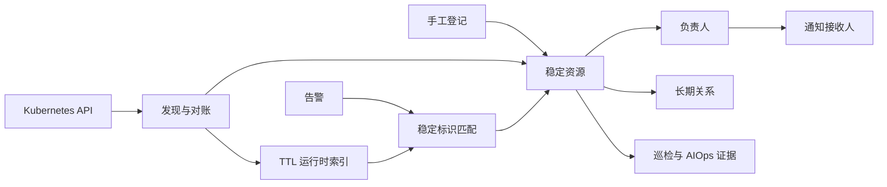

# 资源中心设计与迁移

## 架构

`Resource` 是资产事实源，`ResourceIdentifier` 保存 UID、IP、端点和外部系统 ID，`ResourceSourceBinding` 保证自动发现幂等，`RuntimeResource` 保存 Pod、Service 等短生命周期对象。自动发现写入的字段可以被人工字段锁覆盖。

## 上线顺序

1. 备份数据库并部署代码。
2. 执行 `python manage.py migrate`。
3. 启动 Scheduler，由其为已有 K8S 集群创建发现源并执行首次对账。
4. 在资源中心核对集群、节点、负责人和关系。
5. 抽查资源详情中的稳定标识、运行时对象和最近变更。
6. 在通知策略中按需启用“追加资源负责人”，使用测试告警验证 IP/UID 匹配；补录资源后可在告警详情执行“重新匹配”。
7. 执行 `python manage.py clear_legacy_asset_data` 预览旧数据。
8. 验收完成后执行 `python manage.py clear_legacy_asset_data --confirm`。

清理命令不会删除任务执行目标、主机凭据、K8S 集群连接或资源中心数据。

## 回滚

代码回滚前保留数据库备份。需要短期恢复旧 Host/ConfigItem 同步时设置 `ENABLE_LEGACY_CMDB_SYNC=true` 并重启后端；该开关只用于迁移回滚，不应与资源中心长期双写。
