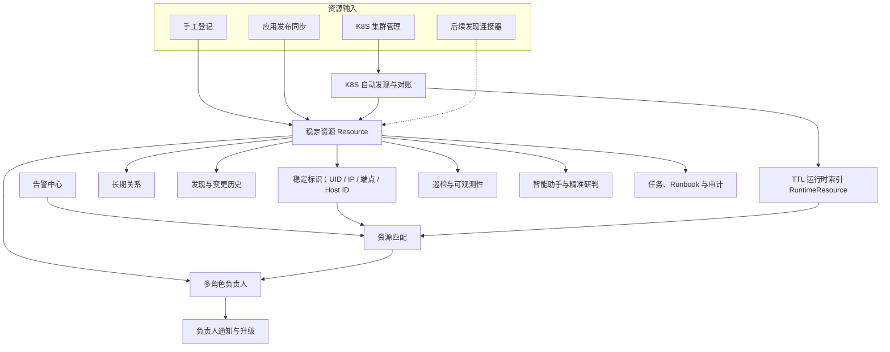
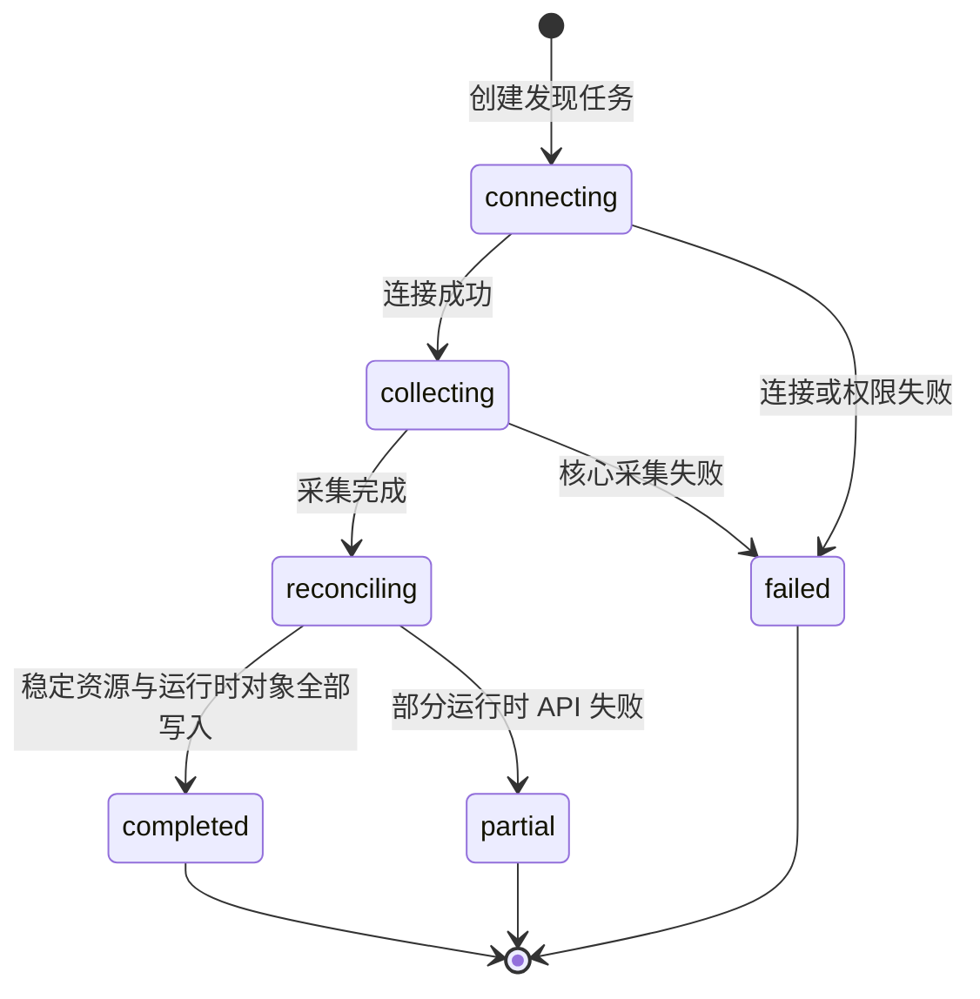
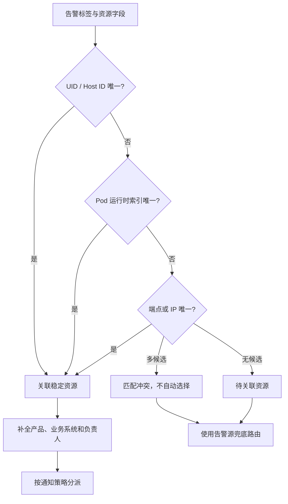

# 资源中心总体设计与迁移方案

> 文档定位：面向管理汇报、产品设计、研发实施和上线迁移。
>
> 当前状态：统一资源模型已建立；K8S 集群与节点自动发现已启用；Zabbix、Prometheus、SSH 发现连接器为后续扩展。
>
> 关联文档：[资源中心使用手册](资源中心使用手册.md)、[外部告警接入方案](外部告警接入方案.md)、[资产中心合并与 CMDB 下线方案](资产中心合并与CMDB下线方案.md)。

## 1. 汇报摘要

资源中心是数智平台统一的资源事实源，解决资产分散、身份不稳定、归属不清、负责人无法用于告警路由等问题。平台将原资产管理与 CMDB 能力合并为一套模型，并将资源身份、业务归属、负责人、长期关系和自动发现结果统一管理。

资源中心不是一张静态资产表，而是告警、巡检、智能研判、任务和审计共同使用的资源底座。

| 建设重点 | 解决的问题 | 对平台的价值 |
| --- | --- | --- |
| 统一资源事实源 | 同一资产在不同模块重复登记、信息不一致 | 各模块引用同一资源 ID 和归属信息 |
| 稳定身份体系 | 名称、IP 或 Pod 重建导致重复资产 | 使用 UID、Host ID、端点和来源绑定保持身份稳定 |
| 自动发现与对账 | K8S 节点靠人工录入，状态容易过期 | 集群接入后自动登记节点并持续对账 |
| 稳定/运行时分层 | Pod、Service 数量大且生命周期短 | 长期资源可治理，短期对象可关联但不污染资产台账 |
| 负责人治理 | 告警只知道机器，不知道通知谁 | 从资源自动解析运维、值班、项目和产品负责人 |
| 关系与变更留痕 | 资源归属和变更难追溯 | 保存长期关系、发现记录和字段变更历史 |

## 2. 建设背景与现状问题

旧资产中心、CMDB、K8S 管理和任务目标各自维护部分资源信息，容易形成以下问题：

1. **多套模型**：主机、中间件、K8S 集群分别存储，字段和身份规则不一致。
2. **重复登记**：同一集群或节点可能被人工录入、同步任务再次创建。
3. **动态对象污染台账**：Pod、Service 等短生命周期对象如果作为长期资产保存，会快速膨胀并失真。
4. **归属无法驱动流程**：产品、负责人只作为文本存在，告警无法自动发送给对应人员。
5. **业务上下文耦合过重**：只想接入集群管理或外部告警时，也被要求先创建业务上下文。

本次设计将“资源登记与治理”和“AIOps 查询范围”解耦。资源可以独立登记和发现；只有智能助手、巡检或精准研判需要组合指标、日志与集群证据时，才按功能绑定业务上下文。

## 3. 建设目标

- 建立唯一、可扩展的资源模型，替代旧资产与 CMDB 双轨体系。
- 支持手工登记物理机、虚拟机、数据库、中间件、产品和应用服务。
- K8S 集群只在集群管理登记一次，资源中心自动发现集群身份和节点。
- 将 Pod、Service、Deployment 等对象作为带 TTL 的运行时索引。
- 使用稳定标识实现发现幂等、告警匹配和跨模块引用。
- 统一维护资源归属、重要级别和多角色负责人。
- 为告警自动分派、巡检范围、智能研判和任务执行提供可靠资源上下文。

## 4. 总体架构

### 4.1 核心数据职责

| 模型能力 | 主要职责 |
| --- | --- |
| `Resource` | 稳定资源身份、名称、环境、状态、产品、业务系统、主 IP、重要级别 |
| `ResourceIdentifier` | 保存 K8S UID、Zabbix Host ID、IP、端点及其他外部稳定标识 |
| `ResourceRelation` | 保存包含、归属、部署、运行和依赖等长期关系 |
| `ResourceContact` | 将资源与平台告警接收人按职责关联 |
| `DiscoverySource` | 管理发现来源、周期、状态和最近错误 |
| `DiscoveryRun` | 记录每次发现的创建、更新、未发现和失败结果 |
| `ResourceSourceBinding` | 维护外部来源对象与平台资源的幂等绑定 |
| `RuntimeResource` | 保存 Pod、Service、工作负载等带过期时间的运行时索引 |
| `ResourceChange` | 记录人工和自动发现造成的字段变化 |

## 5. 资源分类与边界

### 5.1 稳定资源

稳定资源具备长期管理、负责人配置、状态追踪和告警归属价值。当前包括：

- 产品、业务系统、应用服务。
- 物理机、虚拟机。
- K8S 集群、K8S 节点。
- MySQL、PostgreSQL。
- Redis、Kafka、RocketMQ。

物理机、虚拟机、数据库和中间件支持手工登记。应用发布可同步应用服务及其部署关系。

### 5.2 运行时资源

Namespace、Deployment、StatefulSet、DaemonSet、Service 和 Pod 等 Kubernetes 对象变化频繁，不作为长期资产保存。它们进入带 TTL 的运行时索引，用于：

- 将 Pod 告警关联到所属集群。
- 为告警研判提供 Owner、节点和当前状态线索。
- 支持从资源详情下钻到 K8S 管理页面。
- 提供当前运行对象数量和短期关系。

### 5.3 资源中心与 K8S 管理的边界

| 模块 | 关注重点 | 典型操作 |
| --- | --- | --- |
| 资源中心 | 稳定身份、归属、负责人、长期关系和生命周期 | 登记资源、维护负责人、发现对账、查看变更 |
| K8S 集群管理 | 实时 Kubernetes 对象和受控管理操作 | 查看 YAML、Pod 日志、Event、工作负载和存储 |

两者不重复：K8S 管理回答“集群现在运行什么”，资源中心回答“这个资源是谁、属于谁、应通知谁”。

## 6. 统一资源身份设计

资源不能只依赖名称或 IP 识别。平台组合使用以下身份：

| 资源场景 | 首选稳定标识 | 辅助标识 |
| --- | --- | --- |
| K8S 集群 | `kube-system` Namespace UID | 集群名称、API Server |
| K8S 节点 | Kubernetes Node UID | 节点名、InternalIP、Provider ID |
| Zabbix 主机 | Zabbix Host ID | 主 IP、主机名 |
| 服务器 | 资源 UUID、主 IP | 序列号、附加 IP、主机名 |
| 数据库/中间件 | 精确端点 `IP/主机名:端口` | 实例名称、所属主机 |
| Pod | Kubernetes Pod UID（运行时） | 集群、Namespace、Pod 名称 |

自动发现通过来源绑定保持幂等。同一外部对象再次发现时更新原资源，不重复创建。人工编辑过的字段进入人工锁定清单，后续自动发现不会覆盖。

## 7. K8S 自动发现与对账

### 7.1 当前流程

1. 管理员在 **平台管理 → K8S 集群管理** 登记连接。
2. 平台为该连接创建资源发现源。
3. 发现任务读取集群身份、节点和运行时对象。
4. 首次发现创建 K8S 集群和节点稳定资源。
5. 后续发现按 UID 对账，更新状态、IP、版本、容量和标签。
6. Pod、Service 和工作负载写入 TTL 运行时索引。
7. 发现结果保存为完成、部分成功或失败，并记录具体错误。

### 7.2 采集内容

- 集群 UID、名称和连接来源。
- 节点 UID、名称、角色、InternalIP、Provider ID。
- Ready 与 Node Conditions。
- Kubernetes、Kubelet、内核和容器运行时版本。
- CPU、内存和 Pod 容量。
- 标签、污点、操作系统和架构。
- Namespace、工作负载、Service 和 Pod 运行时索引。

节点短时未返回不会立即判定下线。平台记录连续未发现次数，避免 API 抖动造成资产状态频繁变化。

### 7.3 当前边界

当前只有 **K8S 自动发现执行器已启用**。模型已为 Zabbix、Prometheus、SSH 和手工来源预留类型，但这些连接器尚未启用，不能在汇报中描述为已完成能力。

## 8. 负责人治理

资源负责人不是姓名文本，而是与平台通知接收人的关联。当前职责包括：

- 运维负责人。
- 值班人员。
- 项目负责人。
- 产品负责人。

推荐治理规则：

| 资源层级 | 建议维护的负责人 | 主要用途 |
| --- | --- | --- |
| 产品 | 产品负责人、公司级运维负责人 | 重大故障升级和跨系统协调 |
| 业务系统/应用 | 项目负责人、应用运维负责人 | 应用告警和发布异常 |
| 主机/数据库/中间件 | 运维负责人、值班人员 | 日常 Warning 和 Critical 告警 |
| K8S 集群 | 集群运维负责人、值班人员 | 节点、控制面、存储和网络告警 |

负责人可按告警级别参与通知：Warning 通知运维与值班人员，Critical 可追加项目与产品负责人。上级资源负责人只有在配置继承规则时才作用于子资源，避免无边界扩散。

## 9. 告警自动关联

告警进入平台后按以下顺序寻找唯一资源：

1. Kubernetes UID。
2. Zabbix Host ID。
3. Pod 运行时索引。
4. 精确端点。
5. IP 地址。
6. 唯一集群名称。

匹配只接受唯一结果。补录资源或修正标识后，可在告警详情执行重新匹配；该操作更新关联与审计记录，不重新触发告警。

## 10. 与其他功能的边界

| 功能 | 是否必须依赖资源中心 | 关系说明 |
| --- | --- | --- |
| 外部告警接入 | 否 | 未匹配也可正常入库；匹配后获得产品和负责人能力 |
| Prometheus 告警规则 | 否 | 规则按告警源和数据源运行；资源匹配用于归属与通知增强 |
| K8S 集群管理 | 否 | 可独立接入和管理；同时为资源中心提供自动发现来源 |
| 智能助手 | 按场景 | 通过业务上下文选择数据源和资源范围 |
| 巡检 | 按场景 | 集群和服务器巡检使用资源范围、数据源和负责人信息 |
| 精准研判 | 非强制但建议 | 资源关系、重要级别和负责人可增强证据与通知 |
| 任务与 Runbook | 按执行对象 | 使用资源身份和凭据引用，不重复维护资产台账 |

业务上下文不是资源登记前置条件。它是智能助手、巡检和研判组合数据源与资源范围时使用的功能级作用域。

## 11. 当前建设成果

### 11.1 当前已实现

- 旧资产中心与 CMDB 合并到统一 `Resource` 事实源。
- 稳定资源、外部标识、长期关系、负责人、发现源、发现历史和运行时索引模型。
- 产品、业务系统、应用服务、主机、数据库和中间件手工登记。
- K8S 集群接入后自动创建发现源并登记集群与节点。
- K8S 发现预览、执行、部分成功、失败诊断和持续对账。
- 告警按 UID、Host ID、Pod、端点、IP 和集群名自动匹配。
- 资源负责人参与分级通知路由。
- 资源详情中的来源、标识、关系、运行时对象和变更记录。

### 11.2 有限支持

- 当前自动发现只支持 K8S；其他发现类型为扩展接口。
- 资源匹配依赖告警提供可识别标识，共享 IP 需要 Host ID、端口或 UID 消除冲突。
- 关系模型已支持长期关系，但部分依赖关系仍需人工维护或由后续发现连接器补充。
- 自动发现资源不建议直接删除，应通过发现源、集群连接和生命周期状态管理。

## 12. 后续扩展重点

后续能力按业务优先级逐步建设，不作为当前已实现能力：

1. **Zabbix 主机发现连接器**：同步 Host ID、接口 IP、Host Group 和模板信息。
2. **Prometheus 目标发现连接器**：从 targets 与稳定标签辅助发现 exporter 和服务端点。
3. **SSH 主机采集**：补充序列号、操作系统、CPU、内存和磁盘基础信息。
4. **待关联工作台**：集中治理未匹配告警和冲突标识，并沉淀长期绑定。
5. **负责人完整性治理**：统计核心资源负责人缺失、渠道无效和继承冲突。
6. **资源质量评分**：按身份完整性、发现时效、归属和负责人完整度输出治理指标。

## 13. 上线迁移附录

### 13.1 上线顺序

1. 备份数据库并确认回滚点。
2. 部署代码并执行 `python manage.py migrate`。
3. 启动 Scheduler，为已有 K8S 集群创建发现源并执行首次对账。
4. 在资源中心核对集群、节点、负责人和关系。
5. 抽查资源详情中的稳定标识、运行时对象和最近变更。
6. 在测试告警源中添加“资源负责人”路由，验证 IP、UID 和端点匹配。
7. 执行 `python manage.py clear_legacy_asset_data` 预览旧数据。
8. 完成备份、核对和业务确认后，执行 `python manage.py clear_legacy_asset_data --confirm`。

清理命令不应删除任务执行目标、主机凭据、K8S 集群连接或资源中心数据。

### 13.2 迁移验收

| 验收项 | 通过标准 |
| --- | --- |
| 身份唯一 | 同一集群、节点和手工资源不存在重复记录 |
| 发现幂等 | 连续执行发现不重复创建资源 |
| 人工保护 | 人工锁定字段不被自动发现覆盖 |
| 状态容错 | 单次未发现不立即标记资源下线 |
| 告警匹配 | UID、Host ID、端点和 IP 能得到预期结果 |
| 冲突安全 | 多候选时明确冲突，不随机选择负责人 |
| 通知闭环 | 资源负责人路由受静默、抑制、聚合和升级控制 |
| 模块解耦 | 未绑定业务上下文的资源和外部告警仍可正常管理 |

### 13.3 回滚

- 代码回滚前保留数据库备份，不执行破坏性反向迁移。
- 需要短期恢复旧 Host/ConfigItem 同步时，可使用迁移期兼容开关 `ENABLE_LEGACY_CMDB_SYNC=true` 并重启后端。
- 兼容开关只用于短期回滚，不允许长期双写，否则会重新产生两套事实源。
- 如果已清理旧数据，应从上线前数据库备份恢复，而不是尝试从资源中心反向拼装旧表。

## 14. 管理指标建议

资源中心建设效果建议通过以下指标持续衡量：

| 指标 | 管理含义 |
| --- | --- |
| 核心资源覆盖率 | 核心产品、主机、集群、数据库和中间件是否已纳管 |
| 稳定标识完整率 | 资源能否被外部告警唯一识别 |
| 负责人完整率 | 告警能否自动找到有效接收人 |
| 自动发现成功率 | K8S 资源数据是否持续可靠 |
| 告警资源匹配率 | 告警能否自动补全产品和负责人 |
| 匹配冲突率 | IP、端点和身份数据是否需要治理 |
| 失联资源处理时长 | 资源生命周期管理是否及时 |

这些指标将资源中心从“录入了多少资产”转向“能否支撑告警定位和责任闭环”的实际价值评估。
