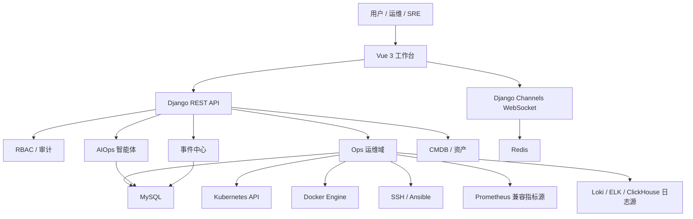

# Xing-Cloud 项目架构

Xing-Cloud 是面向运维现场的智能运维平台，核心目标是把资产、平台、任务、工单、可观测性、事件和 AIOps 串成可审计、可确认、可执行的工作流。

## 总体架构

## 后端模块

| 模块 | 说明 |
| --- | --- |
| `ops` | 主机、任务、发布、K8S、Docker、日志、指标、平台告警、运行概览。 |
| `aiops` | 智能体对话、模型供应商、Skill、Action、MCP、审计和待确认动作。 |
| `eventwall` | 平台事件和外部事件沉淀，用于审计、复盘和 AIOps 上下文。 |
| `rbac` | 用户、角色、权限、菜单和后端 API 权限控制。 |
| `cmdb` | 配置项、资源关系、资产视图和拓扑基础能力。 |
| `sqlaudit` | SQL 数据源、SQL 查询、SQL 工单和审核流程。 |
| `multicloud` | 多云凭据和云资源管理扩展。 |

## 前端模块

| 页面 | 说明 |
| --- | --- |
| 运行概览 | 智能运维平台驾驶舱，聚焦 SLA、产品 SLA、工单及时率、告警和风险项。 |
| 资产登记 | 维护一级业务、环境、资产、运维负责人、项目负责人。 |
| 平台管理 | K8S 集群和容器环境管理。 |
| 可观测性 | 平台总览、监控看板、日志中心、告警中心。 |
| 任务中心 | 主机/K8S 任务、批量命令、Playbook、任务模板和执行记录。 |
| 工单系统 | 应用发布、审批流、SQL 审计、事务工单。 |
| 事件中心 | 事件墙、事件环境、事件源和操作审计线索。 |
| AIOps | 智能助手、知识图谱、智能体配置、智能体审计。 |

## 可观测性边界

当前可观测性只保留监控、日志、平台告警三条主线：

- 指标：Prometheus 兼容接口，用于 PromQL 查询和原生监控看板。
- 日志：Loki、ELK/Elasticsearch、ClickHouse。ClickHouse 支持为一个连接配置多个数据库/表集合。
- 告警：平台规则主动触发，支持 AI 研判、静默、抑制、聚合、升级和通知推送。

已移除的能力：

- Jaeger、SkyWalking、Tempo、Zipkin 链路追踪模块。
- SLS 日志源。
- 告警中心外部反向 Webhook 接入。
- 旧版跨系统跳转兼容逻辑。

日志字段中的 `trace_id`、`span_id`、`request_id` 仍可作为普通检索字段使用。

## 告警设计

告警中心以“平台自带告警能力”为主：

1. 告警规则从指标、日志、K8S、SLA 或平台内置规则中主动评估。
2. 命中规则后生成 `Alert`，来源统一为平台规则。
3. 告警进入聚合、抑制、静默、升级策略。
4. AI 研判根据规则、证据、历史上下文生成结论和建议。
5. 通知规则把结果主动推送到邮件、短信、语音、钉钉、飞书、企微等渠道。

客户系统不需要向告警中心配置回调地址。外部系统事件仍应进入事件中心，而不是告警中心。

## 数据存储

| 数据 | 默认存储 |
| --- | --- |
| 平台业务数据 | MySQL |
| 缓存、WebSocket、短期状态 | Redis |
| 指标数据 | 外部 Prometheus 兼容源 |
| 日志数据 | 外部 Loki、ELK、ClickHouse |
| 事件和审计 | MySQL |

当前测试阶段不保留历史演示数据，部署时可使用全新的数据库和 Redis。
