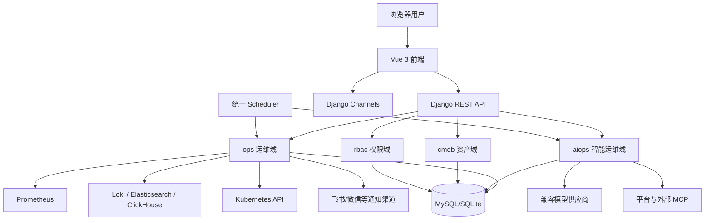
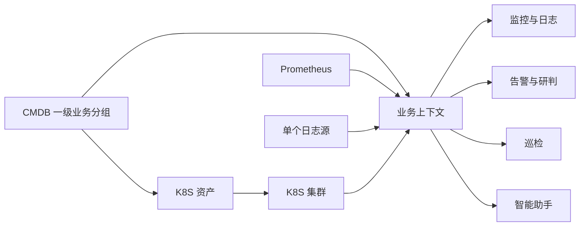
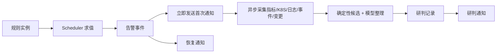

# Xing-Cloud 项目架构

> 本文描述当前仓库实际架构，不描述历史目标架构。

## 1. 总体架构

当前是单体 Django 应用，不是由七个独立 Agent 服务组成的微服务架构。

## 2. 前端

- Vue 3、Vue Router、Pinia、Element Plus。
- 路由集中在 `frontend/src/router/index.js`。
- `AppLayout.vue` 根据权限和模块可见性生成菜单。
- 业务上下文 Store 为相关页面提供统一默认范围。
- 智能助手既有独立页面，也以全局浮层存在。

当前一级菜单为运行概览、AIOps、可观测性、任务中心、资产管理、工单系统、平台管理和系统管理。

## 3. 后端模块

| 模块 | 主要职责 |
| --- | --- |
| `ops` | K8S、数据源、指标/日志、看板、告警、通知、巡检、任务、发布和工单 |
| `aiops` | 会话、业务上下文、知识图谱、Action、Skill、MCP、模型、Runbook 和智能体审计 |
| `cmdb` | CMDB 统计、资源关系和成本等资产接口 |
| `rbac` | 用户、角色、用户组、权限、模块和操作审计 |
| `xing_cloud` | Django 配置、路由、ASGI/WSGI 和基础设施配置 |

## 4. 调度

管理命令 `run_ops_scheduler` 启动统一调度循环，负责：

- 主机计划任务。
- 数据源健康检查。
- 告警规则评估。
- 等待中的告警精准研判。
- 到期巡检报告。

当前实现不以 Celery Beat 或 Redis Stream 作为告警调度事实。

## 5. 业务上下文数据流

指标源和日志源是可复用目录资源。上下文内保持单值选择，但同一个数据源可以用于多个上下文。

## 6. 告警与研判链路

启用 `auto_analyze` 的规则在首次通知后立即进入精准研判。单一已知 Warning 使用定向采集，Critical、未知类型、核心服务和关联告警风暴使用完整采集。模型受证据编号和置信度上限约束，不能创建无证据根因。

统一 Scheduler 负责规则求值，`xing-cloud-alert-analysis` 使用相同 Django 镜像独立消费研判队列。两者按数据库任务状态协作，避免规则批量查询阻塞研判；该 Worker 只是运行进程，不构成新的智能体或微服务。

## 7. AIOps 运行结构

- Action：问题入口、上下文要求、风险和输出结构。
- Skill：专业方法、工具依赖和输出规范。
- MCP：平台工具和外部工具接入。
- Model Provider：模型地址、密钥、默认/备用模型和超时。
- Pending Action：需要用户确认的写操作草稿。
- Runbook：可版本化的运维手册。

确定性巡检和部分诊断在服务端直接执行，不依赖模型主动 tool-calling。

## 8. 存储与缓存

- 业务数据由 Django ORM 持久化，生产部署通常使用 MySQL。
- Redis 可用于缓存、Channels 和部署运行依赖，但具体用途由配置决定。
- K8S、Prometheus 和日志证据按请求采集；当前不保存独立 K8S 现场快照。

## 9. 内部与遗留能力

- 看板定义后端具备 CRUD、导入和导出接口，固定看板前端未开放编辑器。
- Docker 管理代码仍存在，但当前路由只保留兼容跳转，不作为产品菜单。
- 异常检测算法是告警和巡检的内部证据能力。
- 当前不包含 APM、Trace 或服务调用图后端。
