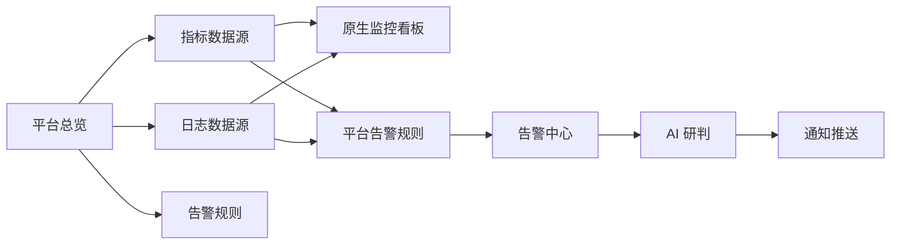

# XingCloud 可观测性模块架构

## 当前边界

可观测性模块当前只围绕三类能力建设：

- 平台总览：展示监控、日志和平台告警的数据源接入状态。
- 监控看板：使用平台原生看板展示服务器、K8S 集群和日志三类视角。指标数据源支持 Prometheus 和 Zabbix。
- 日志中心：接入 Loki、ClickHouse、OpenObserve、ELK/Elasticsearch，用于容器日志、K8S 事件、Ingress 访问日志等检索分析。
- 告警中心：平台主动基于监控、日志、K8S、SLA 等规则触发告警，执行 AI 研判，并按通知策略推送到指定渠道。

暂不提供 Jaeger、SkyWalking、Tempo、Zipkin 的接入和查询能力。日志中的 `trace_id`、`span_id`、`request_id` 只作为普通日志字段用于检索和关联线索，不代表平台内置链路追踪模块。SLS 数据源已下线，以 OpenObserve 替代。

## 数据源

| 类型 | 模型 | 说明 |
| --- | --- | --- |
| 指标 | `MetricDataSource` | Prometheus / Zabbix 兼容数据源，用于 PromQL 查询和原生监控看板。Zabbix 数据源规划中。 |
| 日志 | `LogDataSource` | 支持 Loki、ClickHouse、OpenObserve、ELK/Elasticsearch。ClickHouse 可配置多个日志集合，例如容器日志、K8S 事件、Ingress 访问日志。 |
| 告警规则 | `AlertRule` / `AlertRuleTemplate` | 平台自带规则，来源包括 Prometheus 指标、Zabbix 告警、ClickHouse 日志、K8S 资源/事件、SLA 和平台内置规则。 |
| 通知 | `AlertNotificationChannel` / `AlertNotificationRule` | 平台主动向邮件、短信、语音、钉钉、飞书、企微等渠道推送告警结果。 |

## 模块关系

## 后端接口

| 能力 | 接口 |
| --- | --- |
| 平台总览 | `GET /api/observability/overview/` |
| 指标查询 | `POST /api/observability/metrics/query/` |
| 指标数据源 | `/api/observability/metric/datasources/` |
| 原生看板查询 | `POST /api/observability/dashboards/query/` |
| 日志供应商列表 | `GET /api/log/providers/` |
| 日志目录 | `POST /api/log/providers/<provider>/catalog/` |
| 日志查询 | `POST /api/log/query/` |
| 日志数据源 | `/api/log/datasources/` |
| 告警列表 | `/api/alerts/` |
| 告警规则 | `/api/alert-rules/` |
| 告警通知配置 | `/api/alert-notification-channels/`、`/api/alert-notification-rules/` |

## 已下线内容

以下内容已经从当前产品边界移除：

- 链路追踪运行时接口、数据源模型和前端页面（SkyWalking / Tempo / Jaeger / Zipkin）。
- 旧版跨系统跳转关联配置。
- SLS 日志数据源。
- 客户系统向告警中心反向写入的告警 Webhook 接入。

事件中心仍可保留外部事件 Webhook，那是事件审计和复盘能力，不属于告警中心反向接入。

## 后续扩展原则

后续重新设计可观测性时，建议先按数据域拆分：

- `metrics`：指标查询、看板聚合、SLA 计算。支持 Prometheus 和 Zabbix 双数据源。
- `logs`：日志检索、字段推荐、日志模式聚合。支持 Loki、ClickHouse、OpenObserve、ELK。
- `alerts`：规则评估、AI 研判、降噪、通知编排。

如果未来重新引入新的可观测数据域，应作为独立数据域重新建模，不复用已删除的旧兼容路径。
